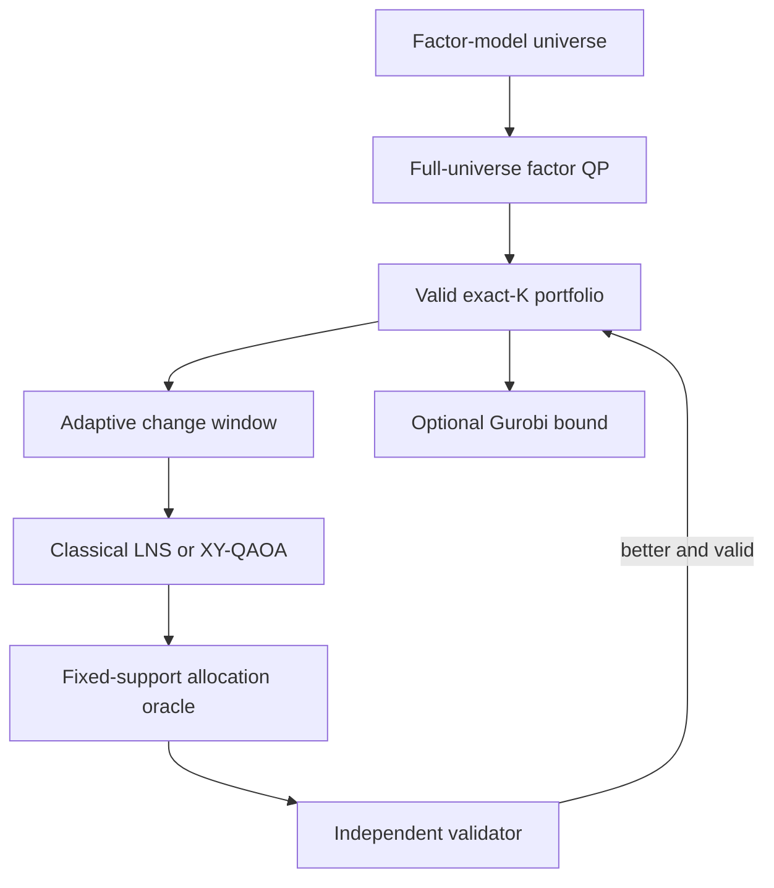

# Constraint-Safe Hybrid Portfolio Optimization

This project combines a scalable factor-risk classical
optimizer with classical large-neighborhood search and fixed-cardinality
XY-QAOA. Every candidate support is assigned exact continuous percentages by a
classical allocation oracle and independently checked before it can become the
recommended portfolio.

The central claim:

> Quantum computing proposes asset swaps inside a small adaptive window.
> Classical optimization assigns percentages, enforces every financial
> guardrail, and supplies the final answer and optimality evidence.

## Architecture



The quantum circuit samples asset supports; every support returns to the same 
continuous allocation model and validator used by the classical search.

## Canonical Objective Function

For asset weights `w` and support decisions `z`, the main model minimizes 

$$ \lambda_r w^T\Sigma w -\lambda_g\mu^T w -\lambda_y y^T w +\lambda_c c^T|w-w^0|, $$

subject to, when enabled, 

$$
\begin{aligned}
&\mathbf{1}^T w=1,\qquad w_i\ge0,\\
&m_i z_i\le w_i\le u_i z_i,\\
&\sum_i z_i=K,\\
&L_g\le\sum_{i\in g}w_i\le U_g,\\
&\mu^T w\ge R_{\min},\quad y^T w\ge Y_{\min},\\
&\|w-w^0\|_1\le T_{\max},\\
&f_{\min}\le B^T w\le f_{\max},\\
&r_s^T w\ge s_s,\quad \text{CVaR}_\alpha(w)\le C_{\max}.
\end{aligned}
$$


## Benchmark Constraints

The benchmark normally enforces the following conditions:

$$ \mathbf 1^T w=1,\qquad m_i z_i\le w_i\le u_i z_i,\qquad \sum_i z_i=K $$

*   **Group Bounds & Turnover:** Enforced alongside a standard turnover cap.
*   **Advanced Limits:** Eligibility, mandatory holdings, income, factor exposure, stress-return, and empirical-CVaR limits are available when data supports them.

## Covariance Matrix Factorization

Generated large instances use a factor model structure:

$$ \Sigma=B\Omega B^T+D $$

*   **Risk Evaluation:** The solver evaluates risk directly from $B$, $\Omega$, and diagonal $D$.
*   **Memory Efficiency:** It does not materialize a full $n \times n$ covariance matrix.
*   **Complexity Reduction:** Storage scales linearly at $\mathcal{O}(nk)$ instead of quadratically, where $k$ is the number of factors.

## Quantum Optimization Surrogate (XY-QAOA)

Inside an $F$-asset change window, XY-QAOA solves a surrogate support problem:

$$ \min_{x\in\{0,1\}^F} x^TQx+h^Tx, \qquad \sum_i x_i=r $$

*   **XY Mixer Function:** Exchanges `10` and `01` bit pairs.
*   **Subspace Preservation:** Starting from an $r$-asset bitstring preserves the exact number of selected window assets under ideal execution.


## What is implemented

- Factor-native continuous optimization with SciPy, OSQP, CVXPY, or Gurobi.
- Deterministic exact-\(K\) initialization with a HiGHS feasibility-MILP
  fallback.
- Cached fixed-support allocation oracle.
- Exact window enumeration for small neighborhoods and tabu/LNS for larger
  neighborhoods.
- Explicit QUBO/Ising construction and constraint-preserving XY-QAOA.
- Fixed-Hamming-weight CPU simulator for parameter optimization.
- Optional Qiskit Aer CPU/GPU sampling and IBM Runtime QPU sampling.
- Direct Gurobi exact-cardinality MIQP with incumbent, bound, and MIP-gap
  reporting.
- Independent validation without clipping or post-solve renormalization.
- CSV/JSON tables, checksums, and matched PNG/PDF presentation graphics.
- A matrix-free scaling study from 250 to 20,000 assets.

## Installation

Python 3.10 or newer is required.

Portable tests and core solver:

```bash
python -m pip install -e ".[test]"
```

Classical QP and MIQP stack:

```bash
python -m pip install -e ".[all-solvers,test]"
```

Portable CPU Aer and IBM Runtime:

```bash
python -m pip install -e ".[full]"
```

On an NVIDIA system, use the compatibility-aware installer:

```bash
python scripts/install_environment.py --profile full
```

The CUDA 12 Aer wheel used by the project requires a Qiskit 1.4 environment,
whereas current IBM Runtime uses Qiskit 2.x. Keep the Aer GPU and IBM Runtime
profiles in separate environments. See [GPU installation](docs/gpu_installation.md)
and [IBM QPU protocol](docs/ibm_qpu_experiment.md).

Gurobi requires a valid license. IBM credentials are managed by
`qiskit-ibm-runtime` and must not be committed to the repository.

## Reproducible runs

Run the tests first:

```bash
python -m pytest -q
```

Tiny certification example:

```bash
python scripts/run_hybrid.py \
  --config configs/tiny_hybrid.yaml \
  --overwrite
```

Two-thousand-asset reference run:

```bash
python scripts/run_hybrid.py \
  --config configs/large_hybrid.yaml \
  --overwrite
```

The large configuration uses matrix-free factor risk, exactly 50 holdings, a
40% L1 turnover cap (20% one-way turnover), three 16-asset change windows, and
optional Gurobi certification.

### Scaling study

The default study runs seven sizes, three seeded repetitions per size, and
writes runtime, quality, feasibility, memory, and quantum timing plots:

```bash
python scripts/run_hybrid_scaling.py \
  --quantum \
  --aer-gpu \
  --output results/hybrid_scaling
```

Default sizes are 250, 500, 1,000, 2,000, 5,000, 10,000, and 20,000 assets.
Gurobi is attempted only through 2,000 assets; larger cases measure the
scalable hybrid-search path and are not described as globally certified.
Each case runs in a fresh process, and the output records peak resident memory,
time to first valid portfolio, component runtimes, objective gaps, and all
skipped components.

A quick portable check is:

```bash
python scripts/run_hybrid_scaling.py \
  --sizes 250 500 1000 2000 \
  --repetitions 1 \
  --quantum-backend subspace \
  --no-gurobi \
  --output results/hybrid_scaling_quick \
  --overwrite
```

### IBM QPU demonstration

Use a separate IBM Runtime environment and run one selected window at 8, 12,
or 16 qubits. An explicit backend is required:

```bash
python scripts/run_hybrid.py \
  --config configs/large_hybrid.yaml \
  --quantum-backend ibm_runtime \
  --ibm-backend <backend-name> \
  --window-size 12 \
  --iterations 1 \
  --quantum-shots 4096 \
  --no-gurobi \
  --output results/qpu_12 \
  --overwrite
```

The hardware run is a component demonstration, not a replacement for the
20,000-asset classical factor solve. The asset-universe size and QPU width are
decoupled: the QPU sees only the adaptive change window.

## Evidence package

Every hybrid run writes:

- `hybrid_summary.csv` for objective, runtime, feasibility, and solver status;
- `allocation_weights.csv` for weights and trades;
- `constraint_checks.csv` for all independently recomputed guardrails;
- `change_windows.csv` for the searched asset neighborhoods;
- `quantum_execution.csv` for requested and actual devices, circuit resources,
  cardinality rate, and phase timing;
- `objective_timeline.csv` and `backtest_summary.csv`;
- `hybrid_diagnostics.json`, `problem.json`, and a SHA-256 artifact manifest;
- matched PNG/PDF figures, including a six-guardrail presentation view and the
  full constraint-slack appendix.

The scaling study writes raw run rows, method rows, per-size summaries, the
resolved study configuration, CPU/GPU and package metadata, SHA-256 checksums,
and four matched PNG/PDF figure pairs. A presentation claim should be traceable
to these tables rather than inferred from a plot.

## Repository map

| Path | Purpose |
|---|---|
| `src/vanguard_portfolio/schemas.py` | Problem, constraints, results, and factor-native matrix operations |
| `src/vanguard_portfolio/portfolio_model.py` | Objective, risk, QP construction, CVaR |
| `src/vanguard_portfolio/allocation.py` | Relaxation, initialization, allocation oracle |
| `src/vanguard_portfolio/window_search.py` | Change windows, enumeration, tabu/LNS |
| `src/vanguard_portfolio/quantum_solver.py` | XY-QAOA, Aer, IBM Runtime, device evidence |
| `src/vanguard_portfolio/classical_discrete.py` | Direct Gurobi MIQP and classical references |
| `src/vanguard_portfolio/validation.py` | Independent hard-constraint checks |
| `src/vanguard_portfolio/presentation.py` | Tables, reports, figures, checksums |
| `scripts/run_hybrid.py` | One configured hybrid experiment |
| `scripts/run_hybrid_scaling.py` | Multi-size, repeated scaling experiment |
| `docs/portfolio_optimization_report.md` | Research-style problem and method report |

## Interpretation limits

- The model is single-period, long-only, and based on estimated inputs.
- Synthetic backtests illustrate behavior; they are not forecasts or financial
  advice.
- Fixed-support QP optimality does not make LNS or QAOA globally optimal.
- A time-limited Gurobi result is reported with its bound and gap, not as an
  unconditional proof.
- Cardinality-preserving quantum samples establish circuit correctness, not
  quantum advantage.
- QPU queue time and all classical preprocessing must be included in an
  end-to-end hardware comparison.

The study methodology, two-thousand-asset reference result, scaling protocol,
and limitations are documented in
[the research report](docs/portfolio_optimization_report.md), with a
[typeset PDF](docs/portfolio_optimization_report.pdf) included for review.
