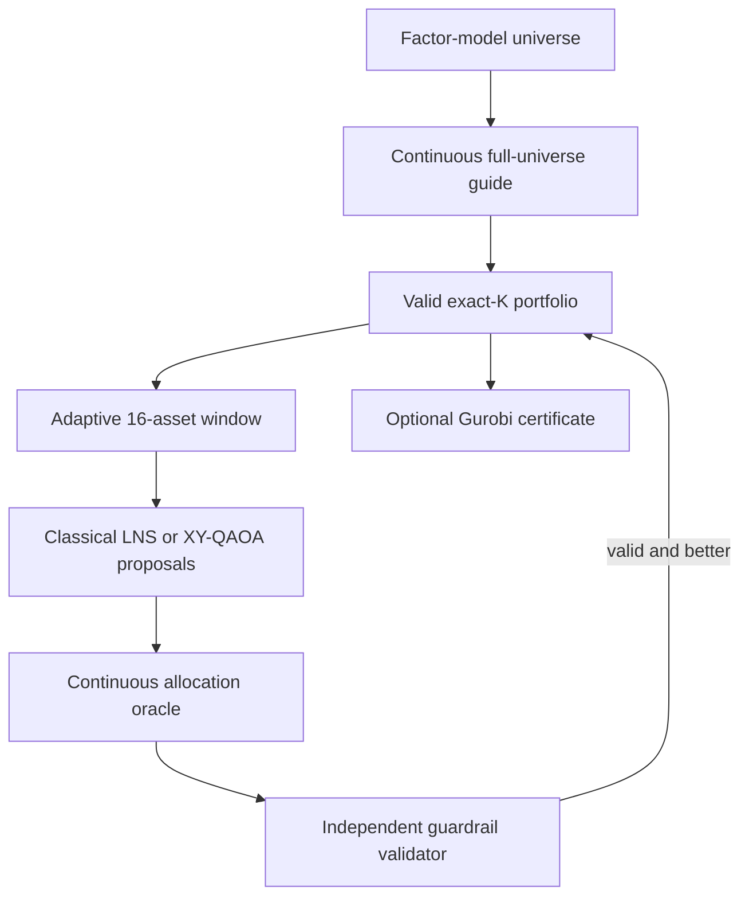

# Vanguard Hybrid Portfolio Optimization

This repository builds a sparse multi-asset portfolio, explains its trade-offs,
and refuses any result that breaks the configured financial guardrails. It
combines a scalable classical optimizer, classical large-neighborhood search,
and an optional fixed-cardinality quantum proposal step.

The central design:

> Quantum computing proposes asset swaps inside a small adaptive window.
> Classical optimization assigns percentages, enforces every financial
> guardrail, and supplies the final answer and optimality evidence.

The final study shows a production-safe solver today and a fair, auditable interface for quantum experiments.

## Start here

| If you want to… | Open |
|---|---|
| Understand the complete study and literature | [Final technical report](docs/portfolio_optimization_report.md) |
| Present the challenge submission | [Editable PowerPoint](docs/presentation/portfolio_optimization_challenge_deck.pptx) or [presentation PDF](docs/presentation/portfolio_optimization_challenge_deck.pdf) |
| Audit a headline result | [Final evidence index](results/final_submission/README.md) and [claim map](results/final_submission/claim_evidence_map.csv) |
| Reproduce the full benchmark notebook | [Vanguard presentation benchmark suite](notebooks/Vanguard_Presentation_Benchmark_Suite.ipynb) |
| Learn the model before reading code | [Mathematical model](docs/mathematical_model.md) and [hybrid algorithm](docs/final_hybrid_model.md) |
| Inspect the quantum formulation | [Quantum model](docs/quantum_model_formulation.md) and [IBM protocol](docs/ibm_qpu_experiment.md) |
| Run the interactive prototype | `streamlit run src/vanguard_portfolio/copilot_app.py` |

## Headline findings

| Evidence level | Result | Meaning |
|---|---|---|
| Globally certified | Tiny enumeration equals Gurobi; the 100-asset case reaches objective **-0.0384147146** at **0.0% reported MIP gap** | The sparse model is correct on tractable instances |
| Globally certified | **17 constraint families** and **244 independent checks** pass in the full gauntlet | “Zero breaches” covers the complete rule set |
| Validated heuristic | A 250-asset, 10,000-scenario case passes **858 independent checks** | Scenario-tail controls coexist with sparse selection |
| Repeated hybrid | **21/21** runs through 20,000 assets return valid portfolios | Full three-window protocol is repeatable |
| Repeated stretch | **27/27** runs through 300,000 assets return valid portfolios | Safe matrix-free engineering scale; not a global optimum claim |
| Hardware observation | IBM tests span 8-28 qubits; all **30/30** post-allocated observations are valid | Noisy samples cannot bypass the safety layer |
| Fair comparison | QPU proposals strictly beat matched random in only **6/30** observations | No quantum-advantage claim |

At 300,000 assets, the median first valid portfolio arrives in **34.69 seconds**
and the complete one-window stretch search takes **112.60 seconds**. Twelve-
factor risk arrays occupy **29.76 MiB**; one dense double-precision covariance
matrix would require **670.55 GiB**. The dense value is storage arithmetic—the
solver intentionally does not allocate that matrix.

## How the solver works



Definitions:

- **Asset universe:** every asset the solver may consider.
- **Weight:** the fraction of capital assigned to an asset.
- **Support:** the set of assets with positive weight.
- **Allocation:** the continuous percentage assigned to each selected asset.
- **Cardinality:** the number of selected assets; exact-\(K\) means exactly
  \(K\) holdings.
- **Continuous guide:** the portfolio solved without the exact-cardinality and
  minimum-active-weight requirements. It ranks assets and can supply a lower
  bound when solved to the required status.
- **Large-neighborhood search (LNS):** a classical method that changes several
  support decisions inside a small window while freezing the rest.
- **XY-QAOA:** a quantum alternating-operator method whose ideal mixer preserves
  the number of selected window assets.
- **Allocation oracle:** the classical convex optimizer that assigns exact
  percentages to one proposed support.
- **Independent validation:** direct recomputation of every rule from returned
  weights instead of trusting a solver status alone.
- **MIP gap:** the normalized distance between a mixed-integer solver's best
  feasible result and its best mathematical bound.
- **Relaxation:** a simpler optimization problem obtained by temporarily
  removing exact-cardinality and minimum-active-weight requirements.
- **Change window:** a small subset of held and unheld assets considered for a
  local support update.
- **QUBO:** a quadratic unconstrained binary optimization surrogate used to rank
  window bitstrings.
- **Incumbent:** the best feasible solution currently known to a mixed-integer
  solver.
- **Best bound:** a solver bound on the unknown global optimum.


The 300,000-asset result is not a 300,000-qubit computation. Quantum execution
receives only a fixed, adaptive window—typically 16 assets—while classical
factor optimization and validation continue to cover the whole universe.

## Portfolio model

For new weights $w$, current weights $w^0$, expected return $\mu$, income yield $y$, covariance $\Sigma$, 
trading costs $c$, and absolute turnover variables $t$, the main model minimizes 

$$ \lambda_r w^T\Sigma w -\lambda_g\mu^T w -\lambda_y y^T w +\lambda_c c^T|w-w^0|, $$

subject to, when enabled, 

$$
\begin{aligned}
&\mathbf{1}^T w=1,\qquad w_i\ge0,\\
&m_i z_i\le w_i\le u_i z_i,\\
&\sum_i z_i=K,\\
&L_g\le\sum_{i\in g}w_i\le U_g,\\
&\mu^T w\ge R_{\min},\quad y^T w\ge Y_{\min},\\
&\|w-w^0\|_1\le T_{\max},\\
&f_{\min}\le B^T w\le f_{\max},\\
&r_s^T w\ge s_s,\quad \text{CVaR}_\alpha(w)\le C_{\max}.
\end{aligned}
$$

The benchmark normally enforces the following conditions:

$$ \mathbf 1^T w=1,\qquad m_i z_i\le w_i\le u_i z_i,\qquad \sum_i z_i=K $$

*   **Group Bounds & Turnover:** Enforced alongside a standard turnover cap.
*   **Advanced Limits:** Eligibility, mandatory holdings, income, factor exposure, stress-return, and empirical-CVaR limits are available when data supports them.

Risk and cost are minimized; expected growth and income are rewarded. Lower objective values are better, but 
the objective is a composite ranking score, not a return percentage.

The model can enforce:

- full investment and long-only positions;
- exact cardinality and minimum/maximum active weights;
- group exposure bands and a turnover cap;
- eligibility and mandatory holdings;
- minimum return and income;
- factor-exposure bands;
- stress-scenario floors;
- empirical conditional value at risk (CVaR), the average loss in the worst
  selected fraction of scenarios; and
- implementation or liquidity caps.

Large instances use $\Sigma=B\Omega B^T+D$, a factor representation. This
evaluates portfolio risk from common-factor loadings and asset-specific
variance without materializing a dense $n \times n$ covariance matrix.

## Installation

Python 3.10 or newer is required.

Core solver and tests:

```bash
python -m pip install -e ".[test]"
```

Classical solver stack:

```bash
python -m pip install -e ".[all-solvers,test]"
```

Complete CPU, GPU, notebook, and IBM Runtime stack:

```bash
python -m pip install -e ".[full]"
python -m pip check
python scripts/install_environment.py --verify-only
```

See [the installation guide](docs/installation.md). Gurobi needs a valid
license. IBM credentials are managed by `qiskit-ibm-runtime` and must never be
committed.

## Reproduce the main experiments

Run tests first:

```bash
python -m pytest -q
```

Tiny correctness and certification case:

```bash
python scripts/run_hybrid.py \
  --config configs/tiny_hybrid.yaml \
  --overwrite
```

Reference hybrid case:

```bash
python scripts/run_hybrid.py \
  --config configs/final_hybrid.yaml \
  --overwrite
```

Three-repetition full-hybrid scaling through 20,000 assets:

```bash
python scripts/run_hybrid_scaling.py \
  --sizes 250 500 1000 2000 5000 10000 20000 \
  --repetitions 3 \
  --cardinality 50 \
  --window-size 16 \
  --backend osqp \
  --relaxation-tolerance 1e-8 \
  --relaxation-time-limit 30 \
  --case-time-limit 180 \
  --quantum \
  --quantum-backend subspace \
  --no-gurobi \
  --output results/hybrid_scaling
```

Use `--resume` to continue compatible checkpoints. A time-limited guide may
fall back to a valid iterate or existing feasible portfolio. When that happens,
the relaxation-gap field remains blank because no solved bound exists.

The complete submission notebook contains the certified cases, scenario and
preference sweeps, scaling aggregation, controlled quantum comparisons, and IBM
hardware audit:

```bash
jupyter lab notebooks/Vanguard_Presentation_Benchmark_Suite.ipynb
```

## Result interpretation

Use these rules when citing the project:

- Call a result **globally certified** only when enumeration or a mixed-integer
  incumbent and bound match.
- Call a result **bounded** only when the continuous guide finished with a
  status that supplies a valid lower bound.
- Call a zero-breach but unbounded result **validated heuristic**.
- Call IBM results **hardware observations** unless a fair end-to-end advantage
  has been demonstrated.
- Do not compare queue-inclusive QPU wall time with a local circuit kernel.
- Do not call ideal Hamming-weight preservation a hardware guarantee.
- Treat synthetic backtests as robustness checks, not forecasts or financial
  advice.

The report and presentation follow these rules explicitly.

## Repository map

| Path | Purpose |
|---|---|
| `docs/portfolio_optimization_report.md` | Final paper: literature, model, algorithm, experiments, results, outputs, limitations, and references |
| `docs/presentation/` | Editable challenge deck, PDF export, and presentation plan |
| `results/final_submission/` | Curated claim-level evidence, certificates, scaling tables, hardware provenance, and figures |
| `notebooks/Vanguard_Presentation_Benchmark_Suite.ipynb` | End-to-end presentation benchmark suite |
| `src/vanguard_portfolio/schemas.py` | Data structures, constraints, and solver-result types |
| `src/vanguard_portfolio/portfolio_model.py` | Objective, factor risk, QP, scenario, and CVaR construction |
| `src/vanguard_portfolio/allocation.py` | Guide solve, exact-\(K\) initialization, and allocation oracle |
| `src/vanguard_portfolio/window_search.py` | Exact window search and classical tabu/LNS |
| `src/vanguard_portfolio/qubo_builder.py` | Window QUBO/Ising surrogate |
| `src/vanguard_portfolio/quantum_solver.py` | Fixed-weight simulation, Aer, IBM Runtime, and circuit diagnostics |
| `src/vanguard_portfolio/classical_discrete.py` | Direct MIQP and classical discrete references |
| `src/vanguard_portfolio/validation.py` | Solver-independent hard-constraint checks |
| `src/vanguard_portfolio/copilot_app.py` | Interactive investor-preference prototype |
| `scripts/run_hybrid.py` | One YAML-configured hybrid experiment |
| `scripts/run_hybrid_scaling.py` | Repeated multi-size scaling benchmark |
| `tests/` | Model, solver, validation, scaling, plotting, and notebook checks |

## Scope and limitations

The model is single-period and long-only. Expected returns, covariances,
factors, and scenarios are estimates. Linear cost does not represent nonlinear
market impact. Taxes, tax lots, leverage, shorting, and multi-period recourse
are outside the present scope. Hardware noise, postselection, QPU queueing, and
weak QUBO/allocation rank alignment currently limit quantum proposal quality.

## Earlier quantum approaches explored (not used in the final pipeline)

Before settling on the classical-guided window search with an optional
XY-QAOA proposal step, this project implemented and ran two other
quantum-first designs: a sampling-based VQE candidate generator, and a
variant of the same loop using Pauli Correlation Encoding (PCE, Sciorilli
et al., *Nat. Commun.* 2025) to compress qubit count. Both remain in the
repository as historical experiments, not as part of the certified pipeline
in [the final report](docs/portfolio_optimization_report.md).

**Lesson 1: a purely heuristic quantum method cannot be the whole pipeline.**
When VQE or QAOA output is used directly as the final answer, rather than as
one candidate generator feeding a classical allocation oracle and validator,
not every hard constraint is reliably satisfied. This is the core reason the
final architecture treats quantum proposals as *suggestions inside a frozen
window*, always followed by an independent classical allocation and
validation step — the same design documented in Section 3 of the report.
Constraint satisfaction is a job for the classical layer, not an emergent
property of the quantum search.

**Lesson 2: PCE trades qubit count for constraint compatibility.** Without
PCE, one asset costs one qubit, so hardware qubit count is a hard ceiling on
universe size (e.g. 216 qubits ≈ 216 assets). PCE breaks that 1:1 mapping and
can represent far more assets per qubit — but the compression introduces a
fundamental tension with constraint handling that gets worse, not better, as
asset count grows: larger universes mean less visibility into which sampled
solutions actually satisfy the encoding's implicit structure. This isn't a
tuning problem; it appears to be intrinsic to compressing many binary
decisions onto few qubits while still needing every hard guardrail checked.

**Why this doesn't block PCE forever.** The current pipeline sidesteps the
qubit-count ceiling a different way: it never puts the whole universe on
qubits. Only a small, adaptive window (typically 16 assets) is ever proposed
quantum-mechanically; the rest of the universe is handled classically. That
architectural choice is why PCE isn't needed today — the qubit-count problem
PCE was meant to solve doesn't arise in a windowed design. If a future
version needed a much larger simultaneous window, or true full-universe
quantum encoding, PCE would be worth revisiting on its own terms, ideally
paired with a way to certify constraint satisfaction independent of sample
visibility.

### Running these experiments (optional - not part of the main experiment)

These scripts are not part of `pytest`, `run_hybrid.py`, or the notebook.
Run them individually:

```bash
python scripts/run_quantum_vqe.py
python scripts/run_vqe_pce.py
python scripts/run_qubit_overhead_sweep_by_scale.py
python scripts/run_scaling_study.py
python scripts/synthetic_uni_scale.py

## Team

- **Andrei Pomorov** — apomorov@usf.edu
- **Ilia Fazeli** — iligili04@icloud.com
- **Kirankumar Dhanireddy** — kirankumardhanireddy@gmail.com
```

Each accepts its own configuration; run any of them with `--help` for
available options. No claim in the final report depends on their output.
