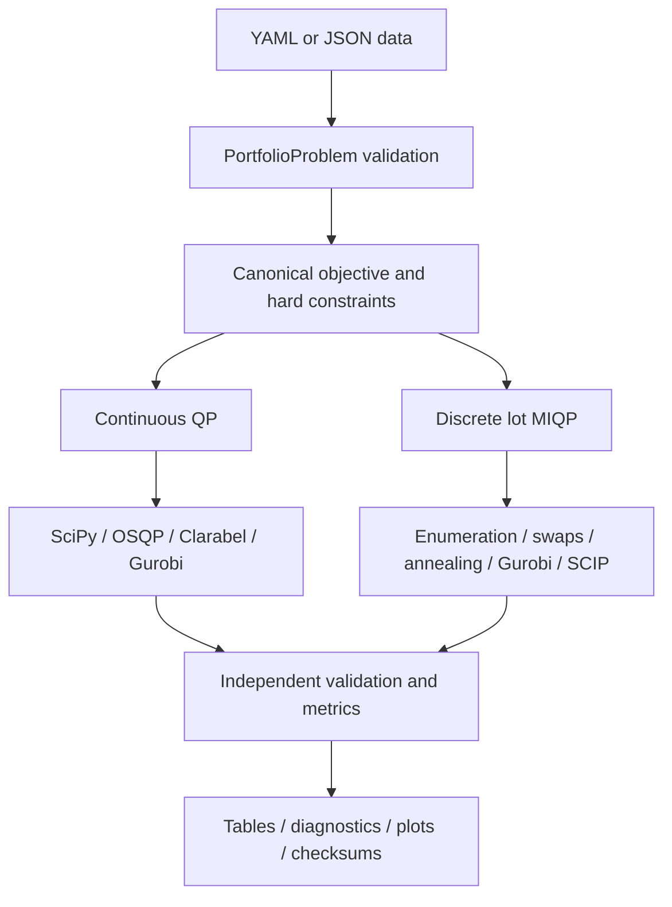

# Vanguard Multi-Asset Portfolio Classical Baseline

This repository provides an auditable classical reference for the WISER
Vanguard multi-asset portfolio challenge. Version 0.3 supports exact small
validation and safe large-instance experiments through one canonical objective,
one problem schema, independent feasibility checks, repeated solver runs,
complete allocation/diagnostic persistence, and large-safe graphics.

## What is implemented

- Continuous convex portfolio QP.
- Discrete equal-lot portfolio MIQP.
- SciPy SLSQP, OSQP, CVXPY/Clarabel, and direct Gurobi QP backends.
- Exact enumeration, deterministic swap search, simulated annealing, direct
  Gurobi MIQP, and CVXPY/SCIP backends.
- Optional hard return and turnover limits.
- Exact tiny-instance certification and continuous/discrete reference gaps.
- Repeated deterministic timings and seeded stochastic trials.
- Per-run weights, integer lots, objective components, constraint checks,
  solver-native diagnostics, environment versions, and artifact checksums.
- Sparse QP construction and O(1) discrete swap deltas for large universes.
- Enumeration safety guards and readable plots for hundreds of assets.

## Architecture



No solver owns a private objective or feasibility rule. Every returned weight
vector is reevaluated by `portfolio_model.py` and `validation.py`.

## Mathematical problem

Every backend minimizes

\[
F(w)=
\lambda_{risk}w^T\Sigma w
-\lambda_{return}\mu^T w
-\lambda_{income}y^T w
+\lambda_{cost}c^T|w-w^{(0)}|
\]

subject to the configured budget, asset bounds, group bounds, optional minimum
return, and optional maximum turnover.

The continuous model uses real weights. The discrete model divides budget into
`M` equal units and uses

\[
w_i=(B/M)q_i,\qquad q_i\in\mathbb Z_{\ge0},\qquad\sum_iq_i=M.
\]

The continuous feasible set contains the lot-grid feasible set, so for this
minimization problem

\[
F^*_{continuous}\le F^*_{discrete}.
\]

See `docs/mathematical_model.md` for the normative equations.

## Install the complete solver stack

Use Python 3.10 or newer. With all mentioned solvers and a working Gurobi
license available:

```bash
python -m pip install -e ".[all-solvers,test]"
```

Verify the commercial license separately:

```bash
python -c "import gurobipy as gp; print(gp.gurobi.version()); print(gp.Model().Status)"
```

The main configurations use `missing_optional: error`, so a requested backend
cannot silently disappear from a formal comparison.

## Run in increasing order of difficulty

### 1. Unit tests

```bash
python -m pytest -q
```

or without pytest:

```bash
PYTHONPATH=src python -m unittest discover -s tests -v
```

### 2. Quick smoke test

```bash
python scripts/run_classical.py --config configs/tiny_example.yaml
```

This uses only the guaranteed baseline stack, 10 lots, and one annealing seed.

### 3. Full six-asset solver cross-check

```bash
python scripts/run_classical.py \
  --config configs/baseline.yaml \
  --strict-optional
```

This requires SciPy, OSQP, Clarabel, Gurobi, and SCIP. Enumeration, Gurobi MIQP,
and SCIP must agree at the same lot resolution. Independent continuous solvers
must agree within numerical tolerance.

### 4. Large 250-asset benchmark

```bash
python scripts/run_classical.py \
  --config configs/large_example.yaml \
  --strict-optional
```

The large configuration uses:

- 250 assets generated from six common factors;
- eight groups;
- 1,000 lots, or 0.1% resolution;
- three repeated OSQP, Clarabel, and Gurobi continuous runs;
- deterministic candidate-pool swap search;
- ten annealing seeds with fast exact swap deltas;
- time-limited Gurobi and SCIP MIQP comparisons;
- no enumeration.

Large results are written to `results/large_example/`.

## Continuous scaling experiment

The scaling runner compares the same backends on the same generated instance
within each `(asset count, instance seed)` pair and repeats every timing:

```bash
python scripts/run_experiment.py \
  --sizes 10 25 50 100 250 500 \
  --backends scipy osqp cvxpy:CLARABEL gurobi \
  --instance-seeds 0 1 2 \
  --repetitions 3 \
  --strict-optional
```

It writes:

- `results/scaling/scaling_benchmark.csv`;
- `results/scaling/scaling_benchmark_summary.csv`;
- `results/scaling/scaling_benchmark_runtime.png`;
- `results/scaling/artifact_manifest.json`.

Objective values should not be compared across different asset counts because
those are different generated optimization problems. Runtime and feasibility
are the intended scaling quantities.

## Detailed solver configuration

A solver may be written as a short string:

```yaml
continuous: [scipy, osqp]
```

or as a detailed specification:

```yaml
continuous:
  - name: gurobi
    repetitions: 3
    options:
      time_limit: 600
      threads: 0
      seed: 0

discrete:
  - name: gurobi
    options:
      time_limit: 600
      mip_gap: 1.0e-3
      mip_focus: 1
```

All `options` are forwarded to the named backend wrapper. CVXPY-native options
are nested under `solver_options`.

## Large-instance safeguards

### Sparse continuous construction

The QP builder creates sparse constraint blocks directly. It does not allocate
a dense `2n x 2n` zero-padded matrix. Covariance PSD is validated once when the
problem is constructed; an eigendecomposition is not repeated for each solver.

### Scalable feasible discrete starts

Local search and annealing obtain a hard-feasible initial lot vector from a
zero-objective SciPy/HiGHS MILP. The previous recursive first-feasible search
was unsuitable for hundreds of assets.

### Fast swap evaluation

With `cov_times_weights = cov @ weights` cached, the exact objective change for
moving one lot from asset `d` to asset `r` is calculated in O(1). After an
accepted move, the cache update is O(n). The earlier implementation evaluated a
full O(n²) quadratic form for every proposal.

### Candidate-pool local search

`candidate_pool_size: null` checks every donor/receiver pair and gives a true
one-swap local optimum. A finite value ranks assets by smooth marginal objective
and checks only the most promising donors and receivers. This bounds large-run
work but remains a heuristic and is reported as such.

### Enumeration guard

Before enumeration begins, an O(nM) dynamic program counts lot vectors that
satisfy the budget and asset lot bounds. If this conservative count exceeds
`max_candidates`, enumeration is intentionally rejected before expensive work
starts. Use Gurobi/SCIP or heuristics for that case.

### Large-safe plotting

Allocation plots display the 30 most important assets plus an aggregated
`Other assets` bar. Correlation labels are hidden above 60 assets. Constraint
plots display the 50 most binding or violated constraints.

## Complete output contract

Each normal run writes:

| File | Contents |
|---|---|
| `benchmark_runs.csv` | One row per run, including objective components and metrics |
| `benchmark_summary.csv` | Aggregated objectives, gaps, runtime quantiles, bounds, and MIP gaps |
| `allocation_weights.csv` | Every asset weight, change, group, and integer lot count |
| `constraint_checks.csv` | Every independent constraint lhs, rhs, slack, and violation |
| `solver_diagnostics.json` | Native iterations, residuals, bounds, nodes, gaps, and timing phases |
| `benchmark_metadata.json` | Problem fingerprint, solver requests, references, and environment versions |
| `problem.json` | Exact serialized optimization instance |
| `resolved_config.yaml` | Exact resolved run configuration |
| `classical_baseline_report.md` | Human-readable comparison |
| `artifact_manifest.json` | File sizes and SHA-256 checksums |
| `*.png` | Allocation, risk-return, runtime, gap, correlation, slack, and sweep plots |

The result directory is now sufficient to recover exact allocations and audit
the solver claims without reading values from a bar chart.

## Notebook usage

After editable installation:

```python
from vanguard_portfolio import Preferences, benchmark_solvers, generate_factor_universe

problem = generate_factor_universe(
    n_assets=250,
    n_groups=8,
    n_factors=6,
    seed=123,
)

report = benchmark_solvers(
    problem,
    Preferences(lambda_return=1.0, lambda_risk=5.0),
    units=1000,
    continuous_backends=[
        {"name": "osqp", "repetitions": 3},
        {"name": "gurobi", "repetitions": 3},
    ],
    discrete_backends=[
        {
            "name": "local_search",
            "options": {"candidate_pool_size": 64},
        },
        {
            "name": "gurobi",
            "options": {"time_limit": 600, "mip_gap": 1e-3},
        },
    ],
    seeds=range(10),
    missing_optional="error",
    require_feasible_results=True,
)

report.summary_records()
```

## Correctness rules

- Lower objective is better only under identical data and preferences.
- Every accepted result must have `feasible=True` and `breaches=0`.
- A heuristic is never marked globally optimal.
- Continuous and discrete references remain separate.
- Enumeration and optimal MIQP must agree at the same `M`.
- Runtime includes model construction, feasible-start work, and solving.
- Stochastic results retain every seed.
- Time-limited MIQP runs retain incumbents, best bounds, nodes, and reported gaps.
- A missing solver or license is an error in formal baseline/large configurations.

## Scope

This is the complete classical implementation of the repository's canonical
single-period, long-only model. It does not silently add taxes, market impact,
multi-period wealth, CVaR, short selling, or explicit cardinality. Those require
new mathematical definitions and data. The discrete MIQP remains the exact
classical reference for the same lot model used by a future QUBO or quantum
implementation.
