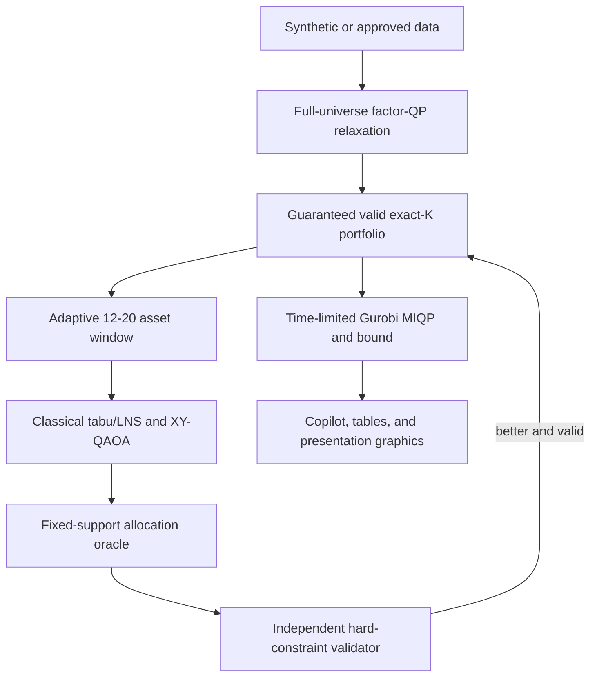

# Constraint-Safe Hybrid Multi-Asset Portfolio Optimization

This repository is the final implementation for the WISER Vanguard
multi-asset portfolio challenge. It combines a scalable factor-risk classical
optimizer with classical large-neighborhood search and fixed-cardinality
XY-QAOA. Every candidate support is assigned exact continuous percentages by a
classical allocation oracle and independently checked before it can become the
recommended portfolio.

The central claim is deliberately practical:

> Quantum computing proposes asset swaps inside a small adaptive window.
> Classical optimization assigns percentages, enforces every financial
> guardrail, and supplies the final answer and optimality evidence.

## Final architecture



The existing equal-lot, QAOA/PCE, sampling-VQE, and VQE/PCE modules are
retained as research baselines. They are not the production decision path.

## What is complete

- Reproducible synthetic and factor-model universes.
- Canonical risk/return/income/cost objective.
- Factorized continuous QP for scalable full-universe optimization.
- Continuous SciPy, OSQP, CVXPY/Clarabel, and Gurobi backends.
- Legacy exact equal-lot enumeration, local search, annealing, Gurobi, and SCIP.
- Exact-cardinality continuous-weight Gurobi MIQP.
- Guaranteed feasible sparse initialization with a SciPy/HiGHS support MILP fallback.
- Cached fixed-support allocation oracle.
- Adaptive weak-held/promising-unheld change windows.
- Classical exact-window enumeration and tabu/LNS.
- Explicit QUBO/Ising construction for the window surrogate.
- Constraint-preserving XY-QAOA with warm or Dicke initialization.
- Dependency-free fixed-Hamming-weight quantum simulator.
- Optional Qiskit Aer CPU/GPU and IBM Runtime sampling.
- Standard penalty-QAOA baseline.
- Optional factor bands, income, stress, and empirical-CVaR guardrails.
- Authoritative independent validation with no clipping or renormalization.
- Streamlit/Plotly Copilot.
- Auditable CSV/JSON/Markdown artifacts and slide-ready PNG/PDF graphics.

## Canonical mathematical model

For asset weights `w` and support decisions `z`, the main model minimizes

\[
\lambda_r w^T\Sigma w
-\lambda_g\mu^T w
-\lambda_y y^T w
+\lambda_c c^T|w-w^0|,
\]

subject to, when enabled,

\[
\begin{aligned}
&\mathbf 1^T w=1,\qquad w_i\ge0,\\
&m_i z_i\le w_i\le u_i z_i,\\
&\sum_i z_i=K,\\
&L_g\le\sum_{i\in g}w_i\le U_g,\\
&\mu^T w\ge R_{min},\quad y^T w\ge Y_{min},\\
&\|w-w^0\|_1\le T_{max},\\
&f_{min}\le B^T w\le f_{max},\\
&r_s^T w\ge s_s,\quad \operatorname{CVaR}_\alpha(w)\le C_{max}.
\end{aligned}
\]

For generated large universes,

\[
\Sigma=B\Omega B^T+D,
\]

so risk is evaluated as

\[
(B^Tw)^T\Omega(B^Tw)+\sum_iD_{ii}w_i^2.
\]

OSQP receives this factor form with `n_factors` auxiliary exposures instead of
a dense quadratic block. Generated universes use a positive common market
factor, group/style factors, and idiosyncratic risk; expected returns are linked
to factor premia rather than sampled independently of risk. Presentation
profiles also set `problem.current_cardinality` so turnover is measured from a
realistic sparse incumbent instead of from thousands of equal-weight holdings.

## Why XY-QAOA is the primary quantum method

Inside one change window, `x_i=1` means that the corresponding asset is held.
If `r` assets in the window must remain selected, the surrogate is

\[
\min_{x\in\{0,1\}^{F}} x^TQx+h^Tx,
\qquad \sum_i x_i=r.
\]

The XY mixer applies `10 <-> 01` exchanges. Starting from an `r`-asset
bitstring therefore keeps every ideal sample at Hamming weight `r`; the main
solver does not tune a cardinality penalty. A standard X-mixer penalty-QAOA is
included only as a baseline.

The surrogate uses equal proxy notionals, covariance with frozen holdings,
return, income, estimated transaction cost, and binding-group pressure. It is
not trusted as the final financial score. Each sampled support is sent to the
same exact allocation oracle as the classical search.

## Repository modules

| Module | Responsibility |
|---|---|
| `schemas.py` | One problem schema, preferences, optional guardrails, and normalized results |
| `data_generation.py` | Synthetic/factor universes, CVaR scenarios, and backtest paths |
| `portfolio_model.py` | Canonical objective, factor risk, QP data, lot helpers, CVaR |
| `classical_continuous.py` | SciPy, OSQP, CVXPY, and Gurobi continuous solvers |
| `classical_discrete.py` | Equal-lot baselines and exact-cardinality Gurobi MIQP |
| `allocation.py` | Relaxation, reduced-support oracle/cache, and feasibility MILP |
| `window_search.py` | Adaptive windows, enumeration, and tabu/LNS |
| `qubo_builder.py` | Window QUBO and Ising conversion |
| `quantum_solver.py` | XY-QAOA, Aer/IBM sampling, and penalty-QAOA baseline |
| `topology.py` | Optional market-community diversity signal |
| `hybrid.py` | Complete production pipeline |
| `validation.py` | Independent checks of all hard constraints |
| `metrics.py` | Financial, solver, CVaR, and backtest metrics |
| `presentation.py` | Tables, reports, checksums, PNG/PDF graphics |
| `copilot_app.py` | Interactive user controls and explanations |

## Installation

Python 3.10 or newer is required.

Portable core and tests:

```bash
python -m pip install -e ".[test]"
```

Recommended classical stack:

```bash
python -m pip install -e ".[all-solvers,test]"
```

Quantum simulator and Copilot:

```bash
python -m pip install -e ".[quantum,app,test]"
```

Portable CPU simulator, IBM Runtime, and Gurobi's Python package:

```bash
python -m pip install -e ".[full]"
```

Gurobi still requires a separate valid license. IBM Runtime uses the account
configuration managed by `qiskit-ibm-runtime`; credentials are never stored in
the repository.

For an NVIDIA machine, use the compatibility-aware installer:

```bash
python scripts/install_environment.py --profile full
```

The CUDA 12 Aer wheel requires Qiskit 1.4, while current IBM Runtime requires
Qiskit 2.x. The installer keeps both GPU simulator profiles isolated from IBM
Runtime packages so later dependency upgrades cannot silently replace Aer.
Keep IBM hardware access in a separate environment; see
`docs/gpu_installation.md`.

## Run in increasing order of difficulty

### Tests

```bash
python -m pytest -q
```

The same suite can run without pytest:

```bash
PYTHONPATH=src python -m unittest discover -s tests -v
```

### Tiny exact certification and full artifact package

```bash
python scripts/run_hybrid.py \
  --config configs/tiny_hybrid.yaml \
  --overwrite
```

### Final 100-asset presentation run

```bash
python scripts/run_hybrid.py \
  --config configs/final_hybrid.yaml \
  --overwrite
```

### 2,000-asset scale run on the server

Install the detected Qiskit Aer build and the classical stack, then run:

```bash
python scripts/install_environment.py --profile full
python scripts/run_hybrid.py \
  --config configs/large_hybrid.yaml \
  --overwrite
```

For a classical-only diagnostic:

```bash
python scripts/run_hybrid.py \
  --config configs/large_hybrid.yaml \
  --no-quantum \
  --no-gurobi \
  --overwrite
```

### Copilot

```bash
streamlit run src/vanguard_portfolio/copilot_app.py
```

The advanced panel exposes return, turnover, income, factor-band, stress-loss,
and empirical-CVaR guardrails. Every change is solved and independently
validated; infeasible combinations are reported instead of silently relaxed.

## Hardware strategy

| Work | Preferred hardware/software |
|---|---|
| Full-universe relaxation | CPU + OSQP factor QP |
| Allocation oracle and classical LNS | CPU; support-reduced, cached evaluations |
| Exact MIQP and optimality bound | Multicore CPU + Gurobi |
| Ideal/noisy circuit development | RTX 6000 48 GB + Qiskit Aer GPU |
| Final 8-16 qubit demonstration | IBM QPU through Runtime |
| Copilot and plots | CPU |

`quantum.backend: subspace` is the portable deterministic reference. For every
backend, QAOA angles are optimized efficiently in the exact fixed-weight CPU
subspace. `aer_gpu` then compiles and samples the equivalent Qiskit circuit on
the GPU. At 16 qubits this is faster than launching dozens of small GPU jobs
during COBYLA and makes the hardware boundary auditable. The result records the
requested backend, actual execution device, verification method, and phase
timings. If GPU execution fails, the runner records the reason and retries Aer
CPU so the quantum comparison is not silently lost.
`ibm_runtime` requires an explicit backend name and is reserved for selected
final windows. Backend calibration should be checked on the run date; no
processor is hardcoded.

## Fair comparisons

All methods use the same input, preferences, hard constraints, exact allocation
oracle, and validator.

1. Continuous factor-QP relaxation and lower bound.
2. Valid sparse initialization.
3. Classical exact-window enumeration on tiny windows.
4. Classical tabu/LNS on scalable windows.
5. Constraint-preserving XY-QAOA.
6. Standard penalty-QAOA baseline.
7. Cold/warm-start Gurobi exact-cardinality MIQP.
8. Legacy equal-lot and PCE/VQE experiments as secondary ablations.

Report objective versus time, time to first valid portfolio, full feasibility,
oracle calls, duplicate supports, Gurobi bound/gap/nodes, quantum cardinality
rate, qubits, shots, actual simulator device, CPU/GPU phase timings, transpiled
depth/two-qubit gates, and out-of-sample risk, return, CVaR, drawdown, and
turnover.

`optimal` refers to global model status. A hybrid support is reported as a
feasible incumbent even when its conditional fixed-support allocation QP is
solved optimally. Gurobi `OPTIMAL` means optimal within its configured MIP
tolerance; the numeric bound and reported gap remain the auditable certificate.

## Output package

Each hybrid run writes:

- `hybrid_summary.csv`;
- `allocation_weights.csv`;
- `constraint_checks.csv`;
- `change_windows.csv`;
- `objective_timeline.csv`;
- `backtest_summary.csv`;
- `quantum_execution.csv` with sampler-device proof and phase timings;
- `hybrid_diagnostics.json`;
- `problem.json`;
- `hybrid_report.md`;
- `artifact_manifest.json` with SHA-256 checksums;
- matched PNG and PDF plots for architecture, allocations, risk-return,
  objective/runtime, anytime convergence, constraints, groups, factors,
  quantum cardinality, circuit resources/timings, communities, and backtesting.

Never present a plot without the matching tables, configuration, validator
output, and checksums.

## Scope and honest interpretation

- The final implementation is single-period and long-only.
- Tax lots, leverage/shorting, nonlinear market impact, and multi-period trading
  remain future extensions.
- PCE and topology are optional signals/ablations, not compulsory filters.
- A QPU run is a quantum-component demonstration, not a speedup claim unless
  equal-time end-to-end measurements prove one.
- The continuous relaxation is a lower bound; a discrete or hybrid method
  should not be claimed to beat it on the same minimization model.
- The final recommendation is valid only when the independent validator reports
  `breaches = 0`.
