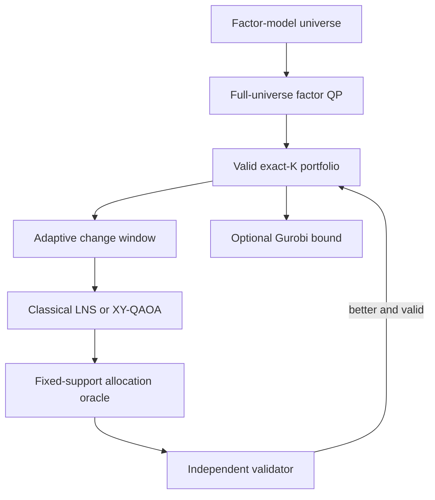

# Constraint-Safe Hybrid Portfolio Optimization

This project combines a scalable factor-risk classical
optimizer with classical large-neighborhood search and fixed-cardinality
XY-QAOA. Every candidate support is assigned exact continuous percentages by a
classical allocation oracle and independently checked before it can become the
recommended portfolio.

The central claim:

> Quantum computing proposes asset swaps inside a small adaptive window.
> Classical optimization assigns percentages, enforces every financial
> guardrail, and supplies the final answer and optimality evidence.

## Architecture



The quantum circuit samples asset supports; every support returns to the same 
continuous allocation model and validator used by the classical search.

## Canonical Objective Function

For asset weights `w` and support decisions `z`, the main model minimizes 

$$ \lambda_r w^T\Sigma w -\lambda_g\mu^T w -\lambda_y y^T w +\lambda_c c^T|w-w^0|, $$

subject to, when enabled, 

$$
\begin{aligned}
&\mathbf{1}^T w=1,\qquad w_i\ge0,\\
&m_i z_i\le w_i\le u_i z_i,\\
&\sum_i z_i=K,\\
&L_g\le\sum_{i\in g}w_i\le U_g,\\
&\mu^T w\ge R_{\min},\quad y^T w\ge Y_{\min},\\
&\|w-w^0\|_1\le T_{\max},\\
&f_{\min}\le B^T w\le f_{\max},\\
&r_s^T w\ge s_s,\quad \text{CVaR}_\alpha(w)\le C_{\max}.
\end{aligned}
$$


## Benchmark Constraints

The benchmark normally enforces the following conditions:

$$ \mathbf 1^T w=1,\qquad m_i z_i\le w_i\le u_i z_i,\qquad \sum_i z_i=K $$

*   **Group Bounds & Turnover:** Enforced alongside a standard turnover cap.
*   **Advanced Limits:** Eligibility, mandatory holdings, income, factor exposure, stress-return, and empirical-CVaR limits are available when data supports them.

## Covariance Matrix Factorization

Generated large instances use a factor model structure:

$$ \Sigma=B\Omega B^T+D $$

*   **Risk Evaluation:** The solver evaluates risk directly from $B$, $\Omega$, and diagonal $D$.
*   **Memory Efficiency:** It does not materialize a full $n \times n$ covariance matrix.
*   **Complexity Reduction:** Storage scales linearly at $\mathcal{O}(nk)$ instead of quadratically, where $k$ is the number of factors.

## Quantum Optimization Surrogate (XY-QAOA)

Inside an $F$-asset change window, XY-QAOA solves a surrogate support problem:

$$ \min_{x\in\{0,1\}^F} x^TQx+h^Tx, \qquad \sum_i x_i=r $$

*   **XY Mixer Function:** Exchanges `10` and `01` bit pairs.
*   **Subspace Preservation:** Starting from an $r$-asset bitstring preserves the exact number of selected window assets under ideal execution.


## What is implemented

- Factor-native continuous optimization with SciPy, OSQP, CVXPY, or Gurobi.
- Deterministic exact-\(K\) initialization with a HiGHS feasibility-MILP
  fallback.
- Cached fixed-support allocation oracle.
- Exact window enumeration for small neighborhoods and tabu/LNS for larger
  neighborhoods.
- Explicit QUBO/Ising construction and constraint-preserving XY-QAOA.
- Fixed-Hamming-weight CPU simulator for parameter optimization.
- Optional Qiskit Aer CPU/GPU sampling and IBM Runtime QPU sampling.
- Direct Gurobi exact-cardinality MIQP with incumbent, bound, and MIP-gap
  reporting.
- Independent validation without clipping or post-solve renormalization.
- CSV/JSON tables, checksums, and matched PNG/PDF presentation graphics.
- A matrix-free scaling study from 250 to 20,000 assets.

## Installation

Python 3.10 or newer is required.

Portable tests and core solver:

```bash
python -m pip install -e ".[test]"
```

Classical QP and MIQP stack:

```bash
python -m pip install -e ".[all-solvers,test]"
```

Complete CPU/GPU/QPU notebook stack in one clean environment:

```bash
python -m pip install -e ".[full]"
python -m pip check
python scripts/install_environment.py --verify-only
```

On Linux x86_64, `full` installs the CUDA-11 build of Aer 0.17.2. That
single distribution contains both CPU and GPU simulators, works with newer
NVIDIA drivers, and shares Qiskit 2.5.1 with IBM Runtime 0.48.0. Other
platforms receive CPU Aer.

If the environment previously contained another Aer distribution or Qiskit
1.4, repair it once before restarting Jupyter:

```bash
python scripts/install_environment.py
```

See the unified [CPU, GPU, and QPU installation guide](docs/installation.md) and the
[IBM QPU protocol](docs/ibm_qpu_experiment.md).

Gurobi requires a valid license. IBM credentials are managed by
`qiskit-ibm-runtime` and must not be committed to the repository.

## Reproducible runs

Run the complete test suite first:

```bash
python -m pytest -q
```

### Tiny correctness and certification example

The tiny configuration is intended for validating the mathematical model,
cardinality handling, quantum candidate generation, and independent constraint
checks on a tractable instance:

```bash
python scripts/run_hybrid.py \
  --config configs/tiny_hybrid.yaml \
  --overwrite
```

### Two-thousand-asset reference experiment

The primary large demonstration uses a 2,000-asset factor-model universe,
exactly 50 holdings, a 40% L1 turnover cap (20% under the one-way convention),
three adaptive 16-asset change windows, classical tabu/LNS, optional XY-QAOA
sampling, and optional Gurobi certification:

```bash
python scripts/run_hybrid.py \
  --config configs/large_hybrid.yaml \
  --overwrite
```

The global portfolio contains 2,000 candidate assets, but the quantum component
operates only on the adaptive 16-asset change window. This is not a
2,000-qubit optimization.

### Scaling study

The default study repeats the presentation-quality core from 250 through 20,000
assets. The notebook uses one visible QP tolerance for both the full-universe
guide and support-reduced allocation. Separate command-line options remain
available for controlled solver studies. Each isolated worker is time-limited,
warm-starts OSQP from the current portfolio, and checkpoints after every case.

```bash
python scripts/run_hybrid_scaling.py \
  --sizes 250 500 1000 2000 5000 10000 20000 \
  --repetitions 3 \
  --cardinality 50 \
  --window-size 16 \
  --backend osqp \
  --relaxation-tolerance 1e-8 \
  --relaxation-max-iter 250000 \
  --relaxation-time-limit 30 \
  --allocation-tolerance 1e-8 \
  --allocation-max-iter 100000 \
  --case-time-limit 180 \
  --quantum \
  --quantum-backend subspace \
  --no-gurobi \
  --output results/hybrid_scaling
```

Use `--resume` to continue a partial directory or `--overwrite` to replace it.
Resume skips successful cases and retries failed cases. The output is
deliberately compact: raw run/method CSVs, one summary CSV, environment/config
manifests, and one four-panel validity/scalability/quantum figure.

By default, a guide relaxation that reaches its explicit time or iteration
limit does not discard the experiment. The hybrid stage continues from a usable
OSQP iterate or the current feasible portfolio; every reported final support is
still solved and independently validated. Such a row is marked
`relaxation_fallback_used=True`. The relaxation-gap field is intentionally
blank whenever the guide was not returned as a solved bound. Pass
`--no-relaxation-fallback` when a strict guide solve is required.

A verified Aer GPU can be selected with `--quantum-backend aer_gpu`. This
accelerates only circuit sampling; the full-universe OSQP factor solve and the
fixed-weight parameter optimizer remain CPU workloads. Benchmark the identical
instance before claiming a GPU speedup.

Large-universe points should be separate, one-repetition stretch tests:

```bash
python scripts/run_hybrid_scaling.py \
  --sizes 35000 50000 80000 100000 \
  --repetitions 1 \
  --cardinality 50 \
  --window-size 16 \
  --backend osqp \
  --relaxation-tolerance 1e-8 \
  --relaxation-time-limit 30 \
  --case-time-limit 180 \
  --quantum \
  --quantum-backend subspace \
  --no-gurobi \
  --allow-failures \
  --output results/hybrid_scaling_stretch
```

A worker that exceeds the outer case limit is recorded rather than allowed to
run indefinitely. Larger instances demonstrate the scalable hybrid-search path
and must not be described as globally certified unless an exact solver returns
a valid bound and gap.

### IBM QPU demonstration

Use the same `full` environment as CPU and GPU simulation. Configure the IBM
account once with `QiskitRuntimeService.save_account`; never place a token in
the repository or notebook.

The current `run_hybrid.py` command does not accept quantum backend, IBM
backend, window size, iteration count, or shot count as command-line
overrides. Configure those values in a YAML file instead.

Create a QPU configuration from the main demonstration configuration:

```bash
cp configs/final_hybrid.yaml configs/qpu_12.yaml
```

Edit the `hybrid` section of `configs/qpu_12.yaml`:

```yaml
hybrid:
  iterations: 1
  window_size: 12
  held_fraction: 0.42

  allocation_backend: osqp
  allocation_options:
    tol: 1.0e-8
    max_iter: 100000
  relaxation_options:
    tol: 1.0e-10
    max_iter: 250000
    time_limit: 180

  run_quantum: true
  run_penalty_qaoa: false
  run_gurobi_reference: false
  use_topology: true
  maximum_quantum_edges: 30

  quantum:
    depth: 1
    shots: 4096
    optimizer_maxiter: 60
    optimizer_starts: 3
    seed: 20260802
    initial_state: warm
    mixer: ring
    backend: ibm_runtime
    ibm_backend: REPLACE_WITH_ACCESSIBLE_BACKEND
    maximum_subspace_states: 400000
    top_candidates: 32
    transpile_optimization_level: 3
```

Then run:

```bash
python scripts/run_hybrid.py \
  --config configs/qpu_12.yaml \
  --output results/qpu_12 \
  --overwrite
```

Begin with an 8-, 10-, or 12-qubit window before attempting the full 16-qubit
circuit. Real-device routing can substantially increase circuit depth and
two-qubit gate count.

The IBM QPU experiment is a hardware-validation demonstration, not a
replacement for the large classical factor-model solve. The global
asset-universe size and QPU width are decoupled: the QPU receives only the
adaptive change-window circuit.

QPU wall time includes queueing, transpilation, submission, and result
retrieval. It must not be presented as directly comparable to local CPU or GPU
kernel time.

## Evidence package

A configured hybrid run writes an auditable evidence package containing:

- `hybrid_summary.csv` — objective, runtime, feasibility, metrics, and solver
  status for every method;
- `allocation_weights.csv` — current and recommended weights and trades;
- `constraint_checks.csv` — independently recomputed hard-constraint checks;
- `change_windows.csv` — held, removable, and candidate assets in each adaptive
  neighborhood;
- `quantum_execution.csv` — requested and actual backend, execution device,
  circuit resources, cardinality-valid shot rate, and phase timings;
- `objective_timeline.csv` — best feasible incumbent versus elapsed time;
- `backtest_summary.csv` — synthetic out-of-sample metrics when backtesting is
  enabled;
- `hybrid_diagnostics.json` — complete solver, window, quantum, and validation
  diagnostics;
- `problem.json` — the generated or loaded portfolio instance;
- a SHA-256 artifact manifest;
- matched PNG and PDF figures for allocation, objective quality, runtime,
  validation, exposures, quantum resources, and backtesting.

The scaling study writes raw trial rows, method-level rows, aggregated
per-size summaries, resolved benchmark settings, hardware and package
metadata, and presentation plots. Claims in the presentation should be
traceable to the generated CSV or JSON records rather than inferred only from
a figure.

For large scaling cases, avoid serializing unnecessary dense problem matrices
or generating dense synthetic backtests unless those artifacts are explicitly
required.

### Copilot

```bash
streamlit run src/vanguard_portfolio/copilot_app.py
```

The advanced panel exposes return, turnover, income, factor-band, stress-loss,
and empirical-CVaR guardrails. Every change is solved and independently
validated; infeasible combinations are reported instead of silently relaxed.

## Hardware strategy

| Work | Preferred hardware/software |
|---|---|
| Full-universe relaxation | CPU + OSQP factor QP |
| Allocation oracle and classical LNS | CPU; support-reduced, cached evaluations |
| Exact MIQP and optimality bound | Multicore CPU + Gurobi |
| Ideal/noisy circuit development | GPU + Qiskit Aer GPU |
| Final 8-16 qubit demonstration | IBM QPU through Runtime |
| Copilot and plots | CPU |

`quantum.backend: subspace` is the portable deterministic reference.
`aer_gpu` uses the Qiskit circuit and the GPU. `ibm_runtime` requires an
explicit backend name and is reserved for selected final windows. Backend
calibration should be checked on the run date; no processor is hardcoded.

## Repository map

| Path | Purpose |
|---|---|
| `src/vanguard_portfolio/schemas.py` | Portfolio data structures, constraints, solver results, and factor-model data |
| `src/vanguard_portfolio/portfolio_model.py` | Return, risk, income, cost, QP, and CVaR model construction |
| `src/vanguard_portfolio/allocation.py` | Continuous relaxation, feasible initialization, and fixed-support allocation oracle |
| `src/vanguard_portfolio/window_search.py` | Adaptive change windows, exact enumeration, and tabu/LNS |
| `src/vanguard_portfolio/quantum_solver.py` | XY-QAOA, fixed-weight simulation, Aer execution, IBM Runtime, and device diagnostics |
| `src/vanguard_portfolio/classical_discrete.py` | Direct Gurobi MIQP and classical discrete references |
| `src/vanguard_portfolio/validation.py` | Independent hard-constraint validation |
| `src/vanguard_portfolio/presentation.py` | Reports, tables, figures, and artifact checksums |
| `src/vanguard_portfolio/copilot_app.py` | Interactive Streamlit portfolio Copilot |
| `scripts/run_hybrid.py` | One YAML-configured hybrid experiment |
| `scripts/run_hybrid_scaling.py` | Repeated multi-size scaling benchmark |
| `docs/portfolio_optimization_report.md` | Research-style mathematical and implementation report |

## Interpretation limits

- The model is single-period, long-only, and depends on estimated or synthetic
  inputs.
- Synthetic backtests illustrate behavior; they are not forecasts or financial
  advice.
- The global asset count is not the number of qubits. The quantum component
  receives only the adaptive change window.
- Fixed-support QP optimality does not make LNS or QAOA globally optimal.
- A time-limited Gurobi result must be reported together with its incumbent,
  bound, status, and MIP gap.
- A continuous-relaxation bound is not the same as a certified mixed-integer
  optimality gap.
- Cardinality-preserving XY-QAOA samples establish circuit correctness, not
  quantum advantage.
- Aer GPU is used for final circuit sampling; parameter optimization currently
  remains on the classical fixed-weight subspace simulator.
- Real-QPU noise may produce samples with the wrong measured Hamming weight.
  Postselection and the exact allocation oracle must therefore remain enabled.
- QPU queue time, transpilation, classical preprocessing, and allocation-oracle
  time must be included in any end-to-end hardware comparison.
- Results from one synthetic seed or one backtest path are illustrative.
  Robust claims require repeated universes, sampling seeds, and out-of-sample
  paths.


The study methodology, two-thousand-asset reference result, scaling protocol,
and limitations are documented in
[the research report](docs/portfolio_optimization_report.md), with a
[typeset PDF](docs/portfolio_optimization_report.pdf) included for review.
