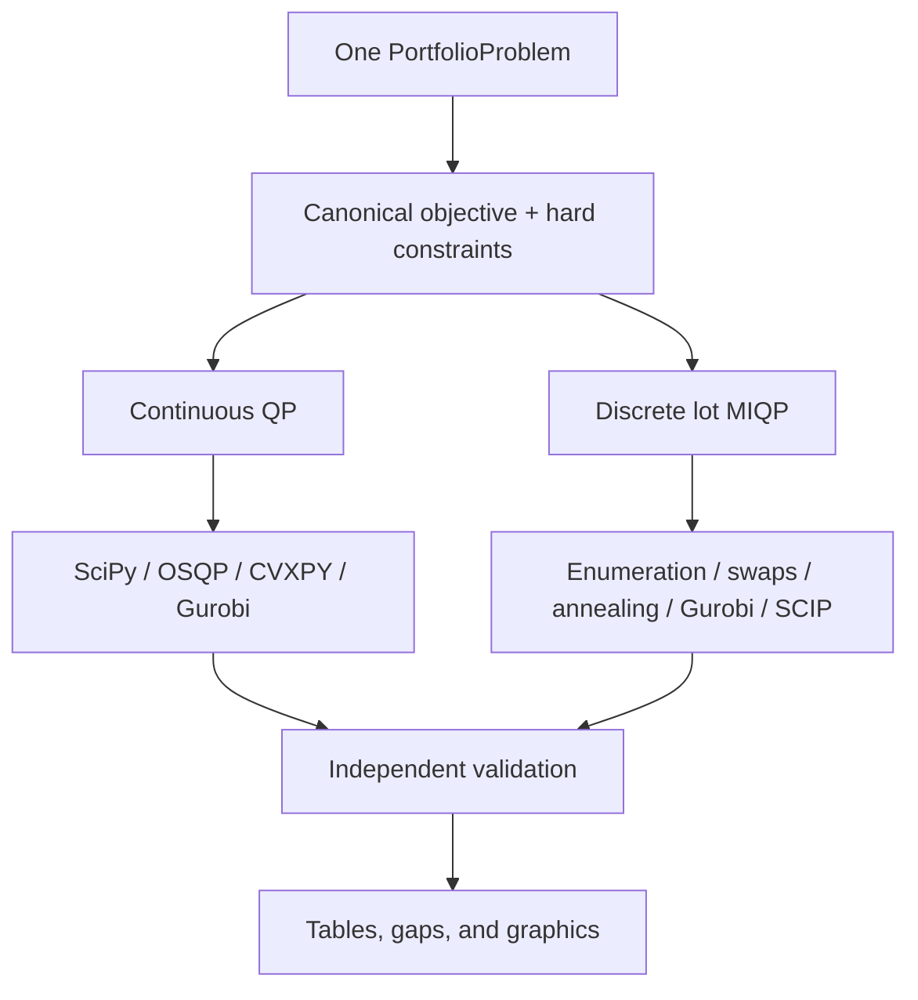

# Vanguard Multi-Asset Portfolio Baseline

This branch provides an classical reference for the WISER Vanguard
multi-asset portfolio challenge. Every backend evaluates the same objective,
uses the same hard constraints, and passes its output through an independent
validator before it enters a comparison table.

The baseline includes:

- a continuous convex quadratic program;
- an exact discrete lot-allocation model;
- deterministic swap search and seeded simulated annealing;
- open-source SciPy, OSQP, and CVXPY interfaces;
- optional direct Gurobi QP/MIQP interfaces;
- reference-gap, exact discrete certification, feasibility, runtime, and allocation comparisons;
- generated allocation, risk-return, runtime, gap, correlation, and constraint plots;
- 30 tests, with optional-solver tests skipped cleanly when a package or license is absent.

## Architecture



The continuous feasible set contains the lot-grid feasible set. Therefore, for
the minimization objective,

\[
F_{\mathrm{continuous}}^* \le F_{\mathrm{discrete}}^*.
\]

Enumeration and an optimal Gurobi/SCIP MIQP solve must agree when they use the
same number of lots. That cross-check is the bridge to future QUBO and quantum
tests.

## Install

Create or activate any Python 3.10+ environment.

```bash
python -m pip install -e ".[qp,test]"
```

Gurobi is optional:

```bash
python -m pip install -e ".[gurobi]"
```

`gurobipy` still needs a valid Gurobi license. If it is missing, the benchmark
records Gurobi as skipped instead of treating that as a model failure.

## Run the complete baseline

From the repository root:

```bash
python scripts/run_classical.py --config configs/baseline.yaml
```

For a quick smoke test:

```bash
python scripts/run_classical.py --config configs/tiny_example.yaml
```

Generated tables and plots appear in `results/`. To require every configured
optional solver instead of skipping missing ones, add `--strict-optional`.

## Run tests

With pytest:

```bash
python -m pytest -q
```

The suite also works without pytest:

```bash
PYTHONPATH=src python -m unittest discover -s tests -v
```

Optional solver tests run only when that backend is installed and usable.

## Use from a notebook

After `pip install -e .`, a notebook can call the package directly:

```python
from vanguard_portfolio import (
    Preferences,
    benchmark_solvers,
    generate_synthetic_universe,
)

problem = generate_synthetic_universe()
report = benchmark_solvers(
    problem,
    Preferences(lambda_return=1.0, lambda_risk=5.0),
    units=20,
    continuous_backends=["scipy", "osqp", "gurobi"],
    discrete_backends=["enumeration", "local_search", "annealing", "gurobi"],
)
report.summary_records()
```

## Key files

| File | Responsibility |
|---|---|
| `schemas.py` | The only `PortfolioProblem`, `Preferences`, and `SolveResult` definitions |
| `portfolio_model.py` | Objective, QP matrices, lot conversion, and direct evaluators |
| `classical_continuous.py` | SciPy, OSQP, CVXPY, and Gurobi continuous backends |
| `classical_discrete.py` | Enumeration, swap, annealing, CVXPY-MIQP, and Gurobi-MIQP |
| `validation.py` | Solver-independent hard-constraint checks |
| `classical.py` | Presets, fair benchmark orchestration, CSV/JSON/Markdown reports |
| `plotting.py` | All generated classical graphics |
| `scripts/run_classical.py` | Config-driven end-to-end entry point |

The precise equations are in `docs/mathematical_model.md`; solver mapping and
benchmark interpretation are in `docs/classical_model_formulation.md`.

## Important interpretation rules

- Lower objective is better.
- Zero hard-constraint breaches is mandatory.
- A heuristic result is never labeled optimal.
- The continuous and discrete optima are different reference problems.
- Runtime includes Python model construction and solver execution.
- Stochastic methods report all seeds and median/interquartile runtime.
- Local post-processing must be identified explicitly; annealing here is named
  `simulated_annealing_swap` because it includes a final one-swap polish.

