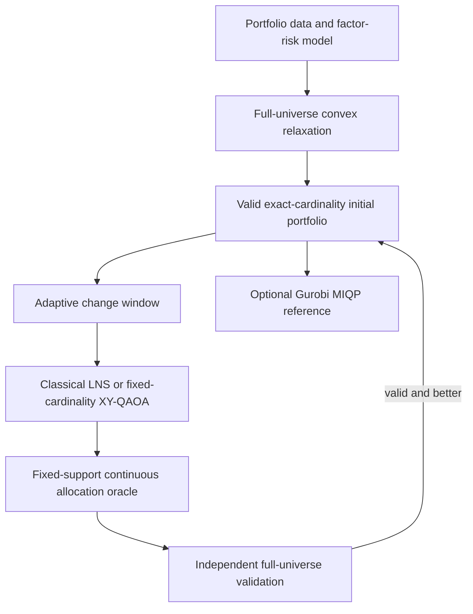

# Documentation Guide

This directory explains the mathematical model, the classical and quantum
algorithms, the validation rules, and the reproducible experiment workflow used
by the project.

The final production path is:

The quantum component proposes asset combinations inside a small change window.
It does not assign final portfolio weights and does not bypass any financial
constraint.

## Recommended Reading Order

| Document | Purpose |
|---|---|
| [`mathematical_model.md`](mathematical_model.md) | Defines all data, variables, objective terms, and hard constraints. |
| [`final_hybrid_model.md`](final_hybrid_model.md) | Explains the complete hybrid algorithm from input validation to final output. |
| [`classical_model_formulation.md`](classical_model_formulation.md) | Explains the continuous, equal-lot, local-search, and Gurobi classical baselines. |
| [`validation_protocol.md`](validation_protocol.md) | Defines the checks required before a result can be accepted or reported. |
| [`gpu_installation.md`](gpu_installation.md) | Describes reproducible Qiskit Aer CPU/GPU environments. |
| [`ibm_qpu_experiment.md`](ibm_qpu_experiment.md) | Defines the IBM hardware experiment and fair reporting requirements. |
| [`portfolio_optimization_report.md`](portfolio_optimization_report.md) | Presents the research motivation, method, interpretation, and limitations. |

## Terminology

- **Asset universe:** every asset that may be considered by the optimizer.
- **Support:** the set of assets with positive portfolio weight.
- **Cardinality:** the number of selected assets.
- **Allocation:** the continuous percentage assigned to each selected asset.
- **Relaxation:** a simpler optimization problem obtained by temporarily
  removing exact-cardinality and minimum-active-weight requirements.
- **Change window:** a small subset of held and unheld assets considered for a
  local support update.
- **Allocation oracle:** the continuous optimizer that assigns exact weights to
  a proposed support and rejects infeasible supports.
- **QUBO:** a quadratic unconstrained binary optimization surrogate used to rank
  window bitstrings.
- **XY-QAOA:** a quantum alternating-operator algorithm whose mixer preserves
  the number of selected window assets in the ideal circuit.
- **Incumbent:** the best feasible solution currently known to a mixed-integer
  solver.
- **Best bound:** a solver bound on the unknown global optimum.
- **MIP gap:** the normalized difference between the incumbent and best bound.
- **Independent validation:** recomputing every hard constraint directly from
  the returned weights instead of trusting a solver status alone.

## Source of Truth

The canonical data structures and objective are implemented in:

- [`../src/vanguard_portfolio/schemas.py`](../src/vanguard_portfolio/schemas.py)
- [`../src/vanguard_portfolio/portfolio_model.py`](../src/vanguard_portfolio/portfolio_model.py)

The final hybrid pipeline is implemented in:

- [`../src/vanguard_portfolio/hybrid.py`](../src/vanguard_portfolio/hybrid.py)
- [`../src/vanguard_portfolio/allocation.py`](../src/vanguard_portfolio/allocation.py)
- [`../src/vanguard_portfolio/window_search.py`](../src/vanguard_portfolio/window_search.py)
- [`../src/vanguard_portfolio/qubo_builder.py`](../src/vanguard_portfolio/qubo_builder.py)
- [`../src/vanguard_portfolio/quantum_solver.py`](../src/vanguard_portfolio/quantum_solver.py)
- [`../src/vanguard_portfolio/validation.py`](../src/vanguard_portfolio/validation.py)

If prose and code disagree, the disagreement must be resolved before a result is
reported. Documentation should not silently describe a model that the software
does not solve.

## Generated Results

Experiment folders under `results/` are generated artifacts rather than source
code. Preserve a complete result package when citing a number. A valid package
contains the resolved configuration, problem data or fingerprint, raw CSV/JSON
tables, validation checks, solver diagnostics, environment metadata, figures,
and artifact checksums.

Plots are explanatory. The CSV and JSON files are the auditable evidence.
