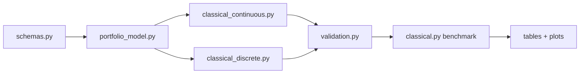

# Classical Baseline: Implementation and Solver Comparison

## Outcome

The classical layer now has one problem schema, one objective, independent
validation, exact tiny-instance certification, optional commercial/open-source
backend comparisons, repeated stochastic trials, and generated artifacts.

The earlier code had two independent `PortfolioProblem` definitions and two
objectives with different scaling and constraint treatment. Those are replaced
by the following dependency direction:



No solver defines a private objective or feasibility rule.

## Backend matrix

| Backend | Model | Role | Certificate |
|---|---|---|---|
| SciPy SLSQP | Continuous QP | Always-available numerical baseline | `optimal=True` only on successful convergence plus independent feasibility; no dual bound |
| OSQP | Continuous QP | Specialized open-source convex QP comparison | Solver status/residuals |
| CVXPY + CLARABEL | Continuous conic/QP representation | Independent modeling stack | Backend status |
| Gurobi QP | Continuous QP | Commercial cross-check | Optimal status |
| Exact enumeration | Discrete lot model | Tiny-instance truth | Exhaustive proof over all feasible lots |
| Swap local search | Discrete lot model | Deterministic heuristic control | No global certificate |
| Simulated annealing + swap | Discrete lot model | Seeded stochastic heuristic | No global certificate |
| Gurobi MIQP | Discrete lot model | Scalable exact/bounded reference | Optimal status or incumbent/bound/gap |
| CVXPY + SCIP | Discrete lot MIQP | Open-source MIQP comparison when installed | Backend status |

OSQP solves convex programs of the form
\(\tfrac12x^TPx+q^Tx\) subject to \(l\le Ax\le u\). The repository builds that
matrix form once and uses the same equations for direct validation. Gurobi sees
a QP when variables are continuous and an MIQP when lot variables are integer.

## Why SciPy is not called "ground truth" by itself

The model is convex, so a correctly converged continuous solve is globally
optimal in theory. In practice, SLSQP is a general constrained numerical
method and does not provide the same certificate as exact enumeration or an
MIQP bound. The credible claim is therefore based on agreement among independent
backends and direct feasibility/objective checks, not on the package name.

## Fair comparison protocol

Every backend receives:

1. the same serialized `PortfolioProblem`;
2. the same `Preferences` coefficients;
3. the same lot count \(M\) for discrete runs;
4. the same hard constraints;
5. the same independent evaluator and tolerance.

Wall-clock time begins before model construction and ends after the solver
returns. Native solver time is retained in metadata when available but is not
substituted for the common wall-clock measure.

Continuous and discrete gaps use separate optimal/exact references. Comparing a
discrete heuristic directly to the continuous optimum would mix algorithmic
error with unavoidable discretization error.

Stochastic annealing runs all configured seeds. Reports show every raw run and
aggregate median/interquartile runtime. The final one-swap polish is part of the
method name and runtime.

## Gurobi setup

Install the Python interface:

```bash
python -m pip install -e ".[gurobi]"
```

Then verify the installation and license separately:

```bash
python -c "import gurobipy as gp; print(gp.gurobi.version())"
```

The benchmark catches both missing-package and license-start failures. A skip is
written to `benchmark_metadata.json`; it is not converted into an infeasible
portfolio result.

## Expected cross-checks

At a fixed \(M\):

- enumeration objective = optimal Gurobi/SCIP MIQP objective, within tolerance;
- no heuristic objective is below the exact optimum;
- continuous objective is no greater than the discrete optimum;
- all reported allocations have zero hard-constraint breaches;
- matrix-form QP evaluation equals direct `objective_value` evaluation.

If any relationship fails, stop before running the quantum model. The likely
causes are objective scaling, lot rounding, a missing hard constraint, or an
incorrect decode.

## Scaling interpretation

Enumeration is deliberately retained only as a tiny truth oracle. The number of
unbounded nonnegative compositions is

\[
{M+n-1\choose n-1},
\]

before bounds and groups prune it. It is not a production solver.

For larger instances:

- use OSQP/Gurobi/another convex backend for the continuous model;
- use Gurobi/SCIP/another MIQP solver for a certified discrete result when
  tractable;
- otherwise report incumbent and bound/gap, plus identically budgeted heuristic
  controls.

The implementation enforces this distinction mechanically. Before enumeration,
an O(nM) dynamic program counts budget/asset-bound-feasible lot vectors. A
configured `max_candidates` guard rejects an unsafe exact search before
recursive enumeration starts.

Continuous QP matrices are assembled from sparse blocks. Covariance PSD is
validated once when `PortfolioProblem` is constructed and is not recomputed for
every backend. The SciPy feasible-start LP also consumes sparse constraints.

For discrete heuristics, a zero-objective SciPy/HiGHS MILP finds a hard-feasible
lot start. A cached `cov @ weights` vector makes the exact one-lot objective
delta O(1) per proposal and O(n) per accepted cache update. Large local-search
runs may set `candidate_pool_size`; finite pools are heuristics and are reported
as `candidate_pool_stationary`, never as a full one-swap certificate.

## Repeated runs and timing phases

Detailed solver specifications may request independent `repetitions`. Each run
gets a unique `run_id`. Common wall-clock runtime includes model construction,
feasible-start work, solver setup, and execution. Native timing phases are also
preserved separately when available:

- `model_build_seconds`;
- `feasible_start_seconds`;
- `solver_setup_seconds`;
- `solve_seconds`;
- native solver runtime.

Time-limited MIQP incumbents remain usable only when independent validation
passes. They are not labeled optimal. Native best bound, node count, and MIP gap
are retained in `solver_diagnostics.json`.

## Auditable output contract

Every normal run persists:

- exact weights and discrete lots in `allocation_weights.csv`;
- objective components and financial metrics in `benchmark_runs.csv`;
- every constraint lhs/rhs/slack/violation in `constraint_checks.csv`;
- nested backend diagnostics in `solver_diagnostics.json`;
- exact input data in `problem.json`;
- exact run controls in `resolved_config.yaml`;
- platform and package versions in `benchmark_metadata.json`;
- file sizes and SHA-256 hashes in `artifact_manifest.json`.

This removes any need to infer numeric allocations from plots.

## Primary solver documentation

- [OSQP problem form and documentation](https://osqp.org/docs/)
- [CVXPY solver selection and installed backends](https://www.cvxpy.org/tutorial/solvers/index.html)
- [Gurobi Python API model classes](https://docs.gurobi.com/projects/optimizer/en/current/reference/python/overview.html)
- [Gurobi quadratic objectives](https://docs.gurobi.com/projects/optimizer/en/current/concepts/modeling/objectives.html)
- [Gurobi model attributes, including bounds and gaps](https://docs.gurobi.com/projects/optimizer/en/current/reference/attributes/model.html)
