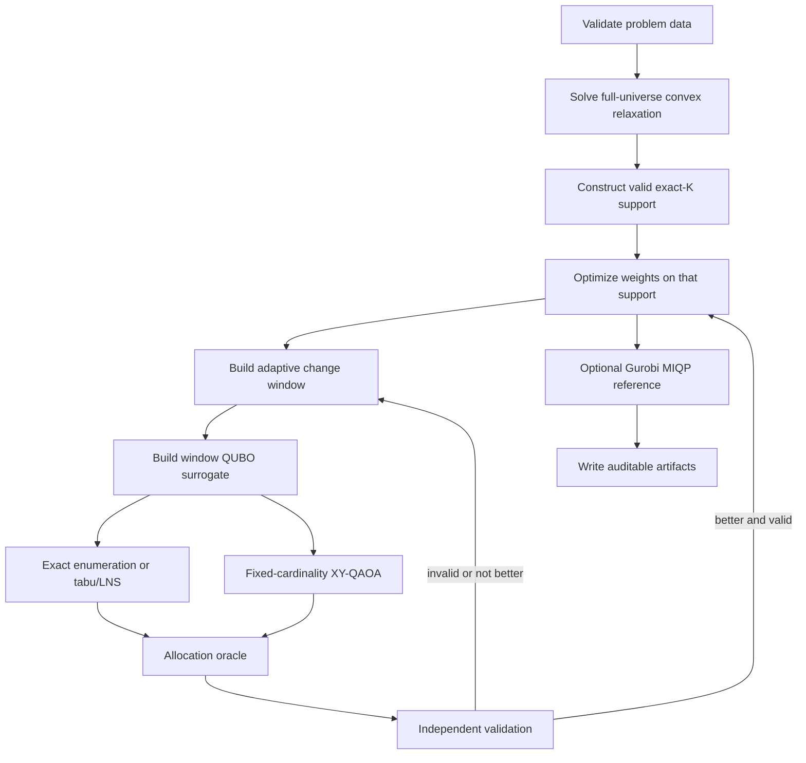

# Hybrid Portfolio Algorithm

## 1. Overview

The hybrid optimizer separates two decisions that have different mathematical
structures:

1. **Support selection:** which assets should be held?
2. **Continuous allocation:** what exact percentage should each selected asset
   receive?

Support selection is combinatorial. Allocation on a fixed support is a convex
continuous optimization problem. The project uses classical large-neighborhood
search and XY-QAOA to propose support changes, then uses the same classical
allocation oracle and validator for every proposal.

The final portfolio is never taken directly from a quantum bitstring.

## 2. End-to-End Pipeline

## 3. Stage 0: Input Validation

Before optimization, `PortfolioProblem` verifies:

- all arrays have the expected dimensions;
- all numerical values are finite;
- asset and group names are unique;
- every asset references an existing group;
- costs and volatilities are nonnegative;
- lower bounds do not exceed upper bounds;
- asset bounds can satisfy the budget;
- dense covariance and correlation matrices are symmetric;
- the correlation diagonal is one;
- covariance equals `corr * outer(sigma, sigma)`;
- the covariance or factor covariance is positive semidefinite;
- a supplied factor model reconstructs the dense covariance when both are
  present;
- factor-model diagonal variance equals `sigma**2`.

`PortfolioConstraints` separately verifies cardinality, eligibility, mandatory
assets, maximum weights, factor bands, stress arrays, and CVaR scenario data.

Invalid data raise an error. The optimizer does not silently repair user input.

## 4. Stage 1: Full-Universe Convex Relaxation

The first solve removes:

- exact cardinality;
- minimum active weight.

It retains the other convex financial rules, including budget, base bounds,
groups, turnover, target return, income, factor, stress, and CVaR constraints
when configured.

The relaxation returns:

- provisional full-universe weights;
- a lower bound on the sparse minimization objective;
- a ranking signal for potential holdings;
- marginal risk information;
- information about binding groups and factors.

For factor-native instances, the QP uses variables

$$
x=[w,t,f],
$$

with

$$
f=B^\top w.
$$

The quadratic block contains the diagonal idiosyncratic-risk terms and the small
factor covariance block. A dense $n\times n$ covariance matrix is not required.

## 5. Stage 2: Construct a Valid Initial Portfolio

The neighborhood search cannot begin from an invalid portfolio.

The initializer first protects:

- mandatory assets;
- assets with positive base lower bounds;
- at least one strong candidate from every group whose lower bound requires
  representation.

Remaining slots are ranked using relaxation weights and marginal objective
signals.

Every proposed support is passed to the allocation oracle. If deterministic
ranked trials fail, a SciPy/HiGHS feasibility MILP jointly searches for:

- binary support variables;
- continuous weights;
- exact cardinality;
- support linkage;
- budget;
- group bounds;
- turnover;
- target return;
- income;
- factor bands;
- stress floors;
- CVaR constraints.

Randomized trials and safe tiny enumeration are fallbacks. The pipeline stops
with an explicit infeasibility error if no valid exact-$K$ portfolio can be
constructed.

No quantum routine runs before this stage succeeds.

## 6. Stage 3: Adaptive Change Window

At hybrid iteration $j$, the current support is divided into:

- **frozen holdings:** selected assets that remain outside the current window;
- **removable holdings:** relatively weak selected assets placed inside the
  window;
- **unheld candidates:** promising eligible assets placed inside the window.

Mandatory assets and positive-lower-bound assets are not offered as removable.

Candidate ranking may use:

- relaxation weight;
- current marginal objective contribution;
- covariance or correlation information;
- group slack and group pressure;
- optional market-community labels;
- whether an unheld asset was already explored in an earlier window.

Let the window contain $F$ assets, and let $r$ of them currently be held. A
window bitstring $x\in\{0,1\}^F$ must satisfy

$$
\sum_{i=1}^F x_i=r.
$$

The frozen support contains $K-r$ assets, so every fixed-weight window proposal
preserves the full portfolio cardinality:

$$
(K-r)+r=K.
$$

## 7. Stage 4: Window QUBO Surrogate

The QUBO is a proposal-ranking model, not the final financial model.

Let:

- $w_F$ be the current allocation with all window entries set to zero;
- $C_W$ be the total capital currently assigned to window assets;
- $a=C_W/r$ be the equal proxy weight assigned to each selected window asset;
- $S_Wx$ map window bits to the full asset universe.

The proxy portfolio is

$$
\widetilde w(x)=w_F+aS_Wx.
$$

Substituting this proxy into the canonical objective gives

$$
E(x)=x^\top Qx+h^\top x+\kappa.
$$

### 7.1 Quadratic Term

$$
Q = \lambda_{\mathrm{risk}}a^2\Sigma_{WW}
$$

where $\Sigma_{WW}$ is the covariance block for window assets.

### 7.2 Linear Term

The linear coefficients include:
- covariance with frozen holdings;
- expected return;
- income;
- proxy transaction-cost changes;
- optional group-pressure adjustments.

In compact form,

$$
h = 2\lambda_{\mathrm{risk}}a(\Sigma w_F)_W - \lambda_{\mathrm{return}}a\mu_W - \lambda_{\mathrm{income}}ay_W + h_{\mathrm{cost}} + h_{\mathrm{group}}
$$

For the equal proxy notional, the transaction-cost change is binary-linear and
is represented exactly relative to the proxy.

### 7.3 Optional Sparsification

Weak pair interactions may be removed, or the number of retained edges may be
capped for hardware experiments. This changes only proposal quality. Every
candidate still returns to the complete factor/covariance model and full
constraint set.

### 7.4 Penalty-QAOA Ablation

The standard X-mixer comparison adds

$$
P\left(\sum_i x_i-r\right)^2
$$

to the QUBO. The production XY-QAOA path does not require this cardinality
penalty because its mixer preserves Hamming weight ideally.

## 8. Stage 5A: Classical Window Search

### 8.1 Exact Enumeration

When

$$
\binom{F}{r}
$$

is below the configured safety threshold, every fixed-weight window state can
be enumerated.

Exact enumeration proves the best QUBO state in that window, but not the global
portfolio optimum. The best QUBO state can still fail the full allocation
problem.

### 8.2 Tabu and Large-Neighborhood Search

For larger windows:

1. start from the current window bitstring;
2. generate one-for-one swaps;
3. rank neighbors by QUBO energy;
4. submit only the best distinct supports to the allocation oracle;
5. cache duplicate supports;
6. use tabu tenure to avoid immediate reversals;
7. use seeded restarts when useful;
8. retain the best valid portfolio objective.

The QUBO is cheap enough to screen many neighbors. The allocation oracle is
reserved for the most promising supports.

## 9. Stage 5B: Fixed-Cardinality XY-QAOA

### 9.1 Cost Hamiltonian

The QUBO is converted to an Ising Hamiltonian

$$
H_C
=
c_0I
+
\sum_i h_iZ_i
+
\sum_{i<j}J_{ij}Z_iZ_j.
$$

### 9.2 XY Mixer

The mixer is

$$
H_M
=
\frac{1}{2}
\sum_{(i,j)\in E}
(X_iX_j+Y_iY_j).
$$

Each interaction exchanges basis states `10` and `01`. It does not create or
destroy an excitation. Therefore, it preserves Hamming weight in the ideal
circuit.

The graph $E$ is either:

- a ring, which gives a shallow default circuit;
- a complete graph, used as an ablation at higher gate cost.

### 9.3 Initial State

The default warm start is the current window bitstring. It already contains
exactly $r$ selected assets.

A Dicke-state initialization is available as an ablation. It starts from a
uniform superposition over all fixed-weight states but requires more expensive
state preparation.

### 9.4 Variational State

For depth $p$,

$$
|\psi(\gamma,\beta)\rangle
=
\prod_{\ell=1}^p
e^{-i\beta_\ell H_M}
e^{-i\gamma_\ell H_C}
|\psi_0\rangle.
$$

Cost coefficients are normalized before angle optimization. Multiple seeded
COBYLA starts reduce sensitivity to one initial angle vector.

### 9.5 Exact Fixed-Weight Subspace Simulator

The dependency-free reference simulator stores only

$$
\binom{F}{r}
$$

basis states rather than all $2^F$ computational states.

For the default 16-qubit, 7-excitation window,

$$
\binom{16}{7}=11{,}440.
$$

This compact CPU simulator optimizes the angles and serves as the deterministic
algorithmic reference.

### 9.6 Aer and IBM Sampling

After angle optimization, the same logical circuit may be sampled with:

- Qiskit Aer CPU;
- Qiskit Aer GPU;
- IBM Runtime hardware.

The requested and actual execution devices, phase timings, circuit depth,
operation counts, shot counts, and cardinality rate are recorded.

A noisy physical circuit may produce invalid-cardinality samples even though
the ideal XY dynamics preserve cardinality. Those samples are reported and are
not silently counted as valid portfolios.

## 10. Stage 6: Fixed-Support Allocation Oracle

For each classical or quantum support:

1. reject invalid asset indices, ineligible assets, missing mandatory assets, or
   incorrect cardinality;
2. set every outside-support upper bound to zero;
3. apply the active lower bound to selected assets;
4. account for turnover caused by liquidating outside-support current holdings;
5. solve the reduced continuous model;
6. reconstruct the full-universe weight vector;
7. independently validate every configured rule;
8. cache the result by support.

A support is accepted only when the reconstructed full-universe portfolio has
zero breaches above tolerance.

Weights are not clipped or renormalized after solving.

## 11. Stage 7: Incumbent Update

The current portfolio is replaced only when a candidate is:

- successfully allocated;
- independently feasible;
- strictly better in the canonical objective by more than numerical noise.

A low QUBO energy alone is insufficient.

## 12. Stage 8: Optional Gurobi Reference

The direct Gurobi model contains:

- continuous weights $w$;
- binary support variables $z$;
- turnover epigraph variables $t$;
- factorized risk;
- exact cardinality;
- all configured hard constraints;
- the best hybrid portfolio as a MIP start.

A time-limited run reports:

- incumbent objective;
- best bound;
- MIP gap;
- node count;
- build time;
- solve time;
- status.

Only an optimal solver status, together with its numerical gap and configured
tolerance, is a global certificate.

If the time limit is reached, a validated incumbent remains useful but is not
called globally optimal.

## 13. Fair Method Comparison

The following comparisons should use the same problem, constraints, windows,
seeds, and timing convention:

- continuous relaxation;
- valid initialization;
- exact window enumeration when tractable;
- tabu/LNS;
- fixed-cardinality XY-QAOA;
- X-mixer penalty-QAOA;
- direct Gurobi exact-cardinality MIQP;
- optional equal-lot small-instance baselines.

The primary comparison uses equal end-to-end time, including model building,
angle optimization, sampling, allocation, validation, and queue time where
applicable.

## 14. Correct Interpretation

The quantum component:

- does propose candidate asset combinations;
- does preserve window cardinality ideally under XY dynamics;
- does not calculate final percentages;
- does not directly enforce every financial guardrail;
- does not replace the allocation oracle;
- does not replace independent validation;
- does not automatically prove quantum advantage;
- does not make a heuristic result globally optimal.

The defensible contribution is a constraint-preserving quantum neighborhood
embedded in a scalable and auditable classical portfolio system.
