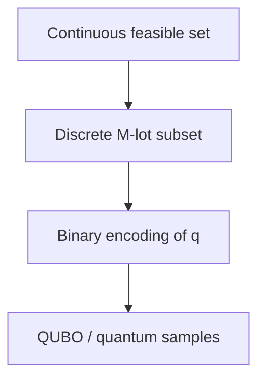

# Multi-Asset Portfolio Construction Model

## 1. Purpose and scope

The model recommends a target allocation across asset classes while balancing
expected return, variance, income, and implementation cost. Budget, allocation
bounds, group exposure limits, and configured guardrails are hard constraints.

This document is normative: every classical, QUBO, and quantum implementation
must reproduce the definitions here. The implemented baseline is single-period,
long-only, and uses annual decimal inputs.

## 2. Sets and parameters

Let \(i\in\mathcal A=\{1,\ldots,n\}\) index assets and
\(g\in\mathcal G=\{1,\ldots,G\}\) index groups.

| Symbol | Meaning |
|---|---|
| \(\mu_i\) | annual expected return of asset \(i\) |
| \(\sigma_i\) | annual volatility of asset \(i\) |
| \(\rho_{ij}\) | return correlation |
| \(\Sigma_{ij}=\rho_{ij}\sigma_i\sigma_j\) | covariance matrix |
| \(y_i\) | annual income yield |
| \(c_i\ge0\) | proportional transaction-cost coefficient |
| \(w_i^{(0)}\) | current allocation |
| \(l_i,u_i\) | hard asset bounds |
| \(a_{gi}\in\{0,1\}\) | group membership |
| \(L_g,U_g\) | hard group exposure bounds |
| \(B\) | total allocation budget; normally \(B=1\) |
| \(R_{\min}\) | optional minimum expected return |
| \(T_{\max}\) | optional maximum turnover |

The covariance matrix must be symmetric positive semidefinite (PSD):

\[
x^\top\Sigma x\ge0\quad\text{for every }x\in\mathbb R^n.
\]

PSD is both financially necessary for nonnegative variance and mathematically
necessary for a convex continuous risk term.

## 3. Portfolio quantities

For target weights \(w\in\mathbb R^n\):

\[
R(w)=\mu^\top w,
\qquad
V(w)=w^\top\Sigma w,
\qquad
\sigma_p(w)=\sqrt{V(w)},
\]

\[
Y(w)=y^\top w,
\qquad
T(w)=\sum_i|w_i-w_i^{(0)}|,
\qquad
C(w)=\sum_i c_i|w_i-w_i^{(0)}|.
\]

Turnover and transaction cost are distinct. Turnover is an unweighted amount
traded; cost weights each trade by \(c_i\).

## 4. Canonical objective

Every solver minimizes

\[
F(w)=
\lambda_{\mathrm{risk}}w^\top\Sigma w
-\lambda_{\mathrm{return}}\mu^\top w
-\lambda_{\mathrm{income}}y^\top w
+\lambda_{\mathrm{cost}}\sum_i c_i|w_i-w_i^{(0)}|,
\]

where all \(\lambda\) coefficients are nonnegative.

There is no hidden factor of \(1/2\) in this financial definition. A backend
whose native form is \(\tfrac12x^\top P x+q^\top x\) must therefore use
\(P_{ww}=2\lambda_{\mathrm{risk}}\Sigma\).

## 5. Continuous convex QP

Introduce epigraph variables \(t_i\ge0\) and solve

\[
\begin{aligned}
\min_{w,t}\quad &
\lambda_{\mathrm{risk}}w^\top\Sigma w
-\lambda_{\mathrm{return}}\mu^\top w
-\lambda_{\mathrm{income}}y^\top w
+\lambda_{\mathrm{cost}}c^\top t \\
\text{s.t.}\quad
&\mathbf1^\top w=B,\\
&l_i\le w_i\le u_i &&\forall i,\\
&L_g\le\sum_i a_{gi}w_i\le U_g &&\forall g,\\
&t_i\ge w_i-w_i^{(0)} &&\forall i,\\
&t_i\ge w_i^{(0)}-w_i &&\forall i,\\
&\mu^\top w\ge R_{\min} &&\text{if configured},\\
&\mathbf1^\top t\le T_{\max} &&\text{if configured}.
\end{aligned}
\]

When transaction-cost terms have positive coefficients, the optimizer drives
\(t_i\) to \(|w_i-w_i^{(0)}|\). The independent evaluator always recomputes
cost directly from \(w\), so a slack \(t_i\) can never distort a reported score.

## 6. Discrete lot MIQP

Divide budget \(B\) into \(M\) equal units of size

\[
\delta=\frac{B}{M}.
\]

Let \(q_i\in\mathbb Z_{\ge0}\) and \(w_i=\delta q_i\). Then

\[
\sum_i q_i=M,
\]

and the exact integer asset bounds are

\[
\left\lceil\frac{l_i}{\delta}\right\rceil
\le q_i\le
\left\lfloor\frac{u_i}{\delta}\right\rfloor.
\]

Lower bounds round upward; upper bounds round downward. This direction is
required to preserve the original continuous constraints.

Group constraints can be enforced directly in weight units,

\[
L_g\le\delta\sum_i a_{gi}q_i\le U_g,
\]

and the objective is exactly \(F(\delta q)\). Gurobi and compatible solvers see
an MIQP: the risk term is quadratic, \(q\) is integer, and every constraint is
linear after the turnover epigraph is introduced.

## 7. Relationship among reference problems

For minimization:

\[
F_C^*\le F_D^*.
\]

Increasing \(M\) improves resolution but grows the exact enumeration space.
The discrete optimum is the correct reference for a QUBO at that same \(M\);
the continuous optimum is not.

## 8. Hard feasibility

A candidate is feasible only if all configured hard constraints hold within the
reported numerical tolerance. The validator checks the unmodified weights; it
does not clip or renormalize a solver output after the solve.

The discrete validator additionally checks that every weight lies on the
\(\delta\)-grid. Hard violations cannot be offset by a better objective.

## 9. Reported metrics

Every run reports:

- objective and its risk/return/income/cost components;
- expected return, variance, volatility, income, turnover, and cost;
- concentration (Herfindahl index) and effective holdings;
- success, feasibility, breach count, and maximum violation;
- wall-clock runtime, backend status, and available native diagnostics;
- absolute and relative gap to an optimal/exact reference within the same model class;
- seed for stochastic methods and lot resolution for discrete methods.

## 10. Explicitly out of scope for this baseline

The baseline does not claim to model taxes, market impact, nonlinear fees,
multi-period wealth dynamics, tail risk, scenario constraints, liabilities, or
short selling. Those extensions require new data and equations and must not be
silently folded into the current objective.
